# Control Room handbook

**Last updated:** 2026-10-06

Use this handbook to understand each surface, its inputs, the records it creates, and how to tell whether work succeeded. The [worked tutorial](WORKED_TUTORIAL.md) supplies a repeatable testing Project. The [API reference](API_REFERENCE.md) describes service requests; the [settings reference](SETTINGS_REFERENCE.md) describes configurable defaults and scopes. The [coverage record](DOCUMENTATION_COVERAGE.md) gives the limits of this documentation run.

Screenshots show a historical browser session. Configuration examples and scripted Chat responses have specific limits; see [screenshot evidence](#screenshot-evidence).

Use the top-level **PlayWeld** menu to reach platform views without depending on IDE layout. Project Home/Create Project appear directly; **Plan & Collaborate**, **Build & Connect**, **Configure & Extend**, and **Review & Maintain** organize the remaining destinations. Project Home repeats the platform routes as purpose-grouped cards. Within a view, choose its section navigation; expand a disclosure to reveal advanced or less frequent inputs. Project selectors and selected sections are independent per view.

## Find a screen

| You want to…                                 | Screen                                                                    |
| -------------------------------------------- | ------------------------------------------------------------------------- |
| Work with files, terminals, or editor layout | [IDE tools and shell](#ide-tools-and-shell)                               |
| Create or open a game workspace              | [Project Home](#project-home-and-the-workspace)                           |
| Configure providers and model selection      | [Models and routing](#models-and-routing)                                 |
| Talk to a model or hand work to an agent     | [Chat](#chat)                                                             |
| Track tasks, approvals, and integration      | [Swarm](#swarm)                                                           |
| Discuss design or search Project information | [Discussion Board](#discussion-board) · [Knowledge](#knowledge)           |
| Configure defaults or agent instructions     | [Settings](#settings) · [Skills and roles](#skills-and-roles)             |
| Connect tools and run native operations      | [Connections](#connections) · [Engine](#engine) · [DCC Tools](#dcc-tools) |
| Generate or inspect artwork                  | [Assets](#assets)                                                         |
| Manage extensions or maintenance             | [Plugins](#plugins) · [Backups](#backups) · [Updates](#updates)           |
| Inspect recorded operations and usage        | [Audit and history](#audit-and-history)                                   |

Each screen description explains what to enter and which records or artifacts to inspect afterward. For an end-to-end example, follow the [tutorial](WORKED_TUTORIAL.md).

## IDE Tools And Shell

**PlayWeld Settings** configures the platform and Project overrides. **IDE Settings** under **PlayWeld > Configure & Extend** opens Theia's editor/workbench Preferences; **Open IDE View** opens its view picker. The original File/Edit/View/Help menus and keyboard shortcuts remain available. Shared styling does not replace their commands or restyle arbitrary third-party webview contents.

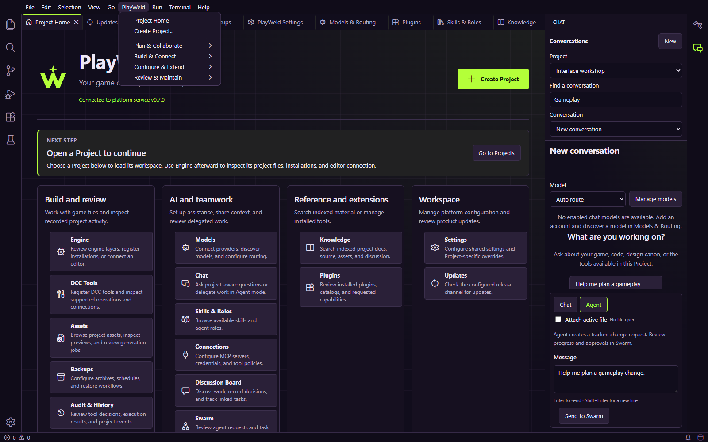

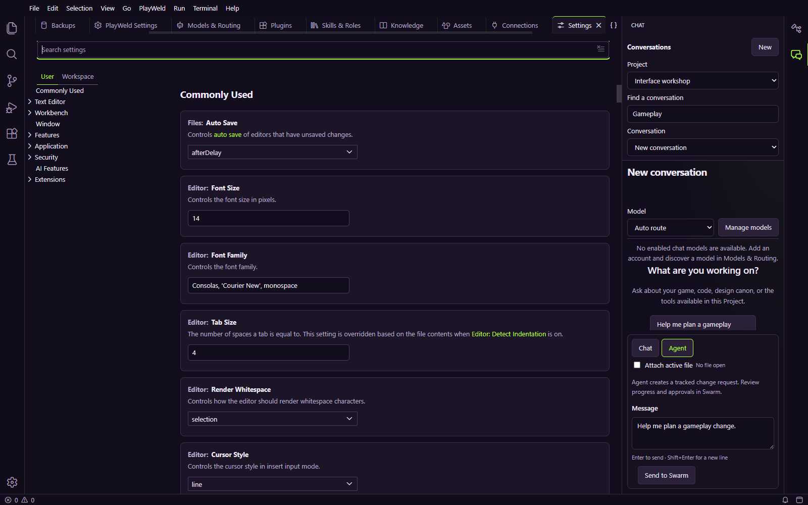

The [shell capture report](images/workspace-shell-2026-10-04/capture-report.json) records the fresh 0.7.0 development browser and a real isolated service on 2026-10-04. It makes no model/provider/engine requests and does not use the private installed profile. This separate eight-image gallery complements the 0.6.0 scripted workflow captures above; it is not installed Electron acceptance.

- [Command palette](images/workspace-shell-2026-10-04/command-palette.png), [About dialog](images/workspace-shell-2026-10-04/about-dialog.png), and [Explorer](images/workspace-shell-2026-10-04/explorer-tree.png) retain native keyboard entry and dismissal.
- [Light theme](images/workspace-shell-2026-10-04/models-light.png) and [High Contrast theme](images/workspace-shell-2026-10-04/models-high-contrast.png) demonstrate theme-token changes in a representative platform view, not an accessibility certification for every widget.
- [Compact Chat](images/workspace-shell-2026-10-04/chat-narrow.png) demonstrates the conversation picker, retained starter draft and reachable send action in a narrow dock; no request was sent.

Reproduce with the rebuilt browser app and `GAMECRAFTER_OVERHAUL_CAPTURE_DIR=docs/images/<new-directory>` when running `node scripts/workspace-overhaul-ui-smoke.cjs`. Publication refuses an existing destination so previous capture evidence is retained.

## Project Home and the workspace

Project Home lists registered Projects, their engine families, paths, creation times, and capability badges. **Create Project** runs the six-step wizard; **Open** opens a registered folder in the current workspace. PlayWeld's Project includes both native game files and platform records. A native engine folder elsewhere on disk is not automatically attached to it.

Use the path, not just the display name, to identify the game. The engine family is locked at creation. Keep native engine files under `game/`; keep authoritative design Markdown under `docs/`. The platform creates its identity manifest and local operational state. Preserve those during recovery.

Project-specific screens can select a Project independently. Check the selector before submitting a request. Closing a tab changes the presentation; it does not delete the underlying records. The service can continue after the desktop window closes, according to `window.closeBehavior`.

## Models and routing

An **account** is an endpoint and its credentials/configuration. A **model** is an enabled provider model with recorded capabilities and pricing. A **pool** groups models eligible for a scope/target. A route is a choice for one request. These records solve different problems; merely adding an account does not create an eligible model.

1. Add a provider account using its preset/base URL, display name, and API key or custom headers when required. Named presets cover OpenAI, Gemini Developer API, OpenRouter, xAI, Mistral, DeepSeek, Groq, Azure OpenAI, and Anthropic; generic OpenAI-compatible endpoints remain available. Multiple accounts for one provider stay distinct.
2. Click **Discover** to preview what that account offers.
3. Select the desired models and **Add selected**, or add all discovered choices deliberately.
4. Inspect enabled state, capabilities, tags, work types, role restrictions, and pricing. Capability values distinguish Supported, Unsupported, and Unknown and show per-field provenance/freshness. Unknown is not Unsupported; clearing a manual value lets later discovery refill it. Provider-published prices are estimates, not invoices.
5. Configure pools when you need a target-specific selection policy.
6. Send a small Chat request and inspect the actual result before relying on the endpoint.

Azure's callable deployment name is the provider model ID; configure or select its base model ID separately for catalog enrichment. Chat routing requires known Chat support. Provider-declared Vision is visible but not routable while chat input is text-only; embeddings use the dedicated embedding operation. Do not enable a capability solely to make routing pass. Role and work-type arrays are hard restrictions and empty means unrestricted; no automatic restriction is applied for provider labels that do not exactly match the local taxonomy.

Choose **Auto route** for service selection or a specific eligible model in Chat. Quality, balance, and cost policies influence routing; cost/latency constraints filter known estimates. Unknown estimates do not guarantee future charges. Inspect actual usage and the separate agent token budget. The [routing guide](MODEL_ROUTING_GUIDE.md) explains those limits. Account credentials belong in the credential store, not Project documents or screenshots.

If routing fails, inspect model enabled state, required capabilities, account availability, relevant pools/targets, context limits, and budget. Provider errors and “no eligible model” errors indicate different layers. See [operations troubleshooting](OPERATIONS_GUIDE.md#troubleshooting).

## Chat

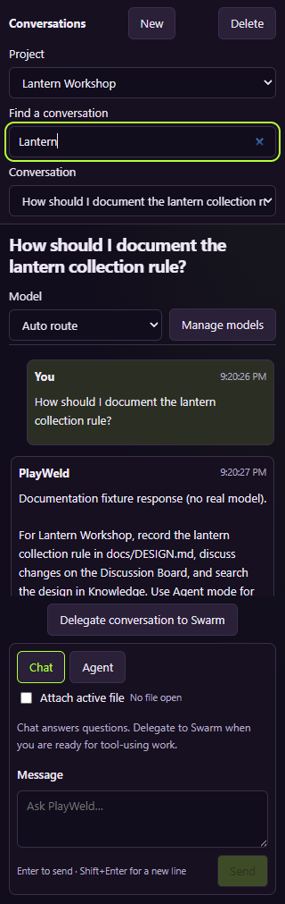

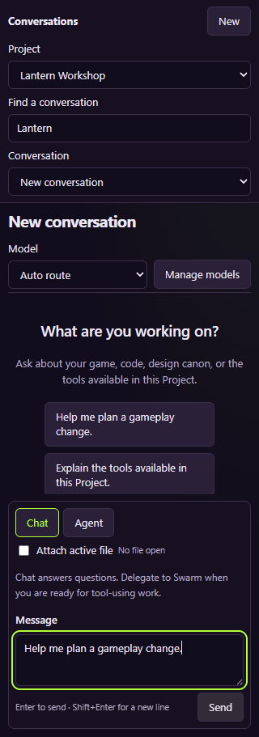

Choose a Project, conversation, model, and mode. **New** starts a conversation; **Find a conversation** filters both the visible conversation list and the conversation selector. A starter on an empty conversation fills the composer as a draft; it does not send the request. **Delete** removes the selected conversation through the service. Enter submits and Shift+Enter inserts a newline. At a compact width the project/search/conversation controls stack above the conversation. The transcript records user/assistant entries and model usage when returned.

**Chat** requests an answer. **Agent** creates supervised work in Swarm. **Delegate conversation to Swarm** hands off a prior request. Chat itself does not expose a general tool loop. An answer proposing code is different from a task that actually edited, validated, and integrated code.

**Attach active file** adds editor context from the selected file. Inspect the file selection before enabling it, especially with cloud endpoints. Project selection is not an instruction to attach every file. If you change conversations while a response is pending, use the pending-status message to return to it and inspect its result.

Example question: “Explain the reset rule in the attached `main.gd` and compare it with `docs/DESIGN.md`.” Example agent request: “Implement a timer in `game/main.gd`, update the design, run the reset/completion checks, and report exact evidence.” Name constraints, acceptance checks, and intended files in implementation requests.

## Swarm

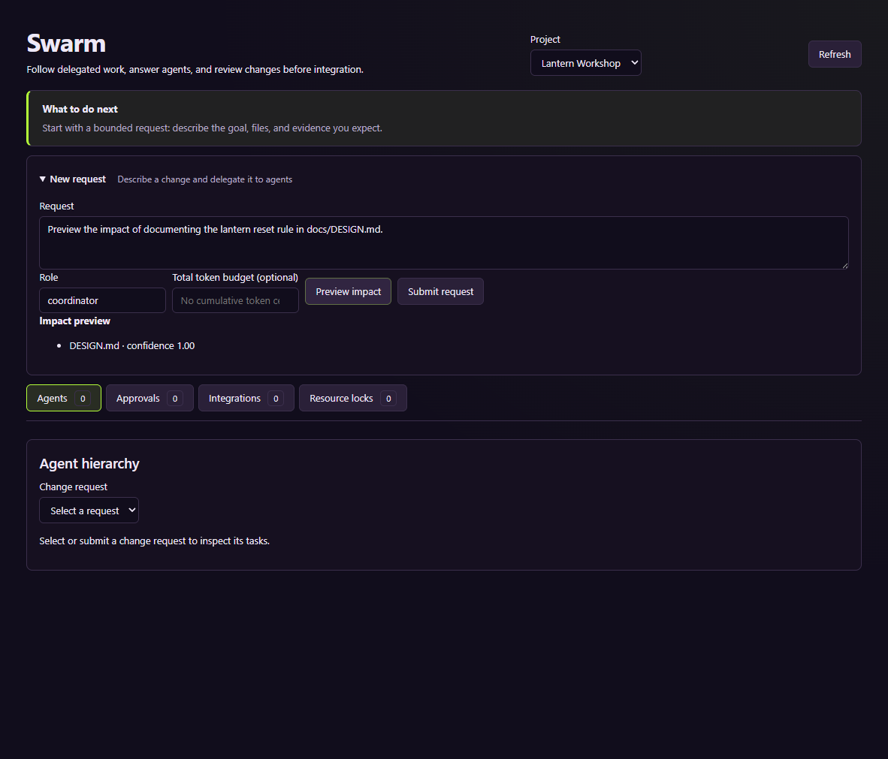

Select the Project and expand **New request** to enter a **Change request**, coordinator **Role**, and **Token budget**. Include Project-relative paths such as `docs/DESIGN.md` or canon IDs so **Preview impact** can identify seeds and inspect related graph nodes. A request without either reports that no IDs/paths were found. **Submit request** creates work. The **Agents**, **Approvals**, **Integrations**, and **Resource locks** sections separate these records. Preview is not execution; a graph with no related nodes is not proof that a change has no effects.

Inspect the selected request's task tree, questions, approvals, resource locks, integrations, and feedback. Task execution uses leases and checkpoints in the service. Worktrees isolate source changes; locks coordinate declared resources such as shared editors or tool sessions.

Goal, result and question text render as structured Markdown, including headings, lists and code; JSON content is indented. Long content stays in a bounded, keyboard-scrollable reader instead of expanding every task into a wall of text. Raw HTML, automatic image loading and executable/file links are not enabled. The task's known recorded spend is not a complete invoice or proof that unknown usage is free; Audit shows pricing coverage separately.

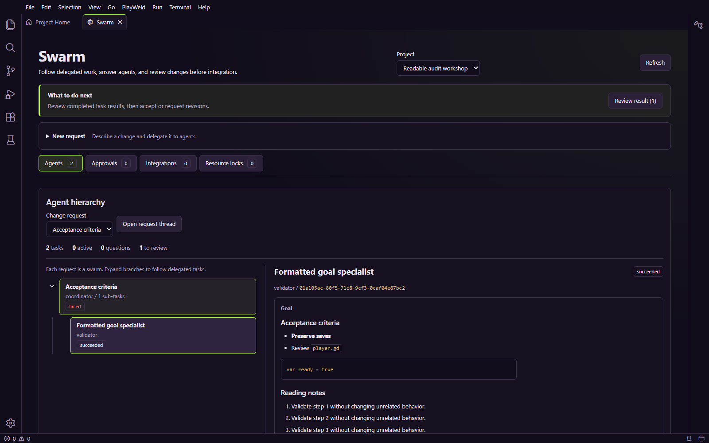

The [current reading/cost capture report](images/audit-detail-2026-10-04/capture-report.json) records an isolated rebuilt 0.7.0-version development browser with pending source changes, not the installed 0.7.0 release. See the [narrow-window reader](images/audit-detail-2026-10-04/formatted-goal-narrow.png) for stacked navigation/detail behavior.

A task waiting for input needs a response. An approval needs a decision about the described tool and effect. A blocked task needs its recorded dependency resolved. For failures, keep the task ID and event trail. Cancelling requests should be checked against owned process/run records to see what stopped.

A task reporting success does not by itself prove that its work is integrated or accepted. Review its evidence, files, conflict status, integration record, and applicable tests. Feedback should describe a reproducible problem or observed result. For example: “The reset test leaves the timer running after R; reproduce after collecting one lantern.”

## Discussion Board

Select the Project and expand **New thread** to create a thread using title, kind, tags, first message, and message type. The **All**, **Open**, **Questions**, **Blockers**, and **Decisions** quick views filter the list; detailed filters select status/kind/tags/search. Opening a thread shows its messages and supported decision actions. Posting a comment, blocker, evidence, or decision message retains discussion context.

Resolve a thread when its question is settled; archive according to the intended workflow. Deletion depends on the access/deletion settings and is different from resolution. A binding decision can produce document proposals; inspect those proposals and their application result. Maintenance **Run audit**, **Run cleanup**, and **Run sync** act on supported board records. Broad reconciliation limitations remain in [implementation status](STATUS.md).

Example evidence message: “Godot version X, fixture revision Y, reset check passed after collecting one lantern; screenshot/log path Z.” A proposal should describe the desired change and rationale. Keep authoritative canon in reviewable Markdown, with links back to the evidence.

## Knowledge

The **Index status**, **Search**, **Canon records**, and **Settings** sections separate indexing, retrieval and configuration. **Reconcile** queues index synchronization. **Rebuild** queues a full rebuild. Inspect records, chunks, vectors, pending work, timestamps, and conflicts. The source files are authoritative; the index is derived data. A plain design document can have indexed chunks while the canon-record count remains zero.

Search accepts query, mode, source, record status/type, and inclusion of inactive records. **Lexical** searches text. **Semantic** requires a configured embedding profile and vector store. **Hybrid** combines retrieval and can report a degraded path. Inspect each hit's citation, path, excerpt, revision, and source before using it as evidence.

The expandable vector/embedding area configures the Project's store and model profile. **Test vector store** checks that connection; it does not prove the embedding provider works. Avoid treating zero vectors as a failed lexical index. If results are stale, inspect pending work and indexing timestamps, reconcile, and retry a source-filtered query.

## Settings

Settings are grouped and searchable. Select a group or search by setting key, then choose the appropriate supported scope and Project/session context. The effective value shows which layer supplied it. Expand **Import and export** to validate, preview, apply, or export a settings file. **Reset** removes an override rather than writing the default as another override. Use the [settings reference](SETTINGS_REFERENCE.md) for exact types, defaults, and allowed scopes.

For a tutorial, search `access.mode` and inspect the source before changing it. **Ask always** permits read-only calls and asks before applicable side effects. **Restricted** uses configured side-effect categories/tool rules. **Full** remains subject to applicable access ceilings, schema/path validation and operation identity checks. Roles and tools can impose additional boundaries.

**Export redacted settings** produces a versioned settings file. **Import** validates a selected file and previews overrides; **Apply overrides** commits the accepted import. Inspect skipped/invalid entries. Exports omit credential-like values and cannot recover missing credentials or encryption keys.

## Skills and roles

Select the Project and inspect each skill's origin, scope, enabled state, and content. **Read guide** opens its `SKILL.md`; referenced documents load through the document selector. Use a skill's instructions and acceptance criteria for the relevant task, rather than treating its presence as proof of available software or engine connectivity.

Platform and Project skills follow Agent Skills conventions. Project instructions live in `AGENTS.md`. Roles define responsibility and tool/access ceilings; a skill cannot grant authority beyond those ceilings. See [game-development skill coverage](GAME_DEVELOPMENT_SKILLS.md) and the [integration guide](INTEGRATION_GUIDE.md) for authoring/install rules.

Example: enable an asset workflow skill for a model task, read the export/validation references, and ask for the editable source plus scale/material/topology evidence. Installing instructions alone does not create the asset or verify its engine import.

## Connections

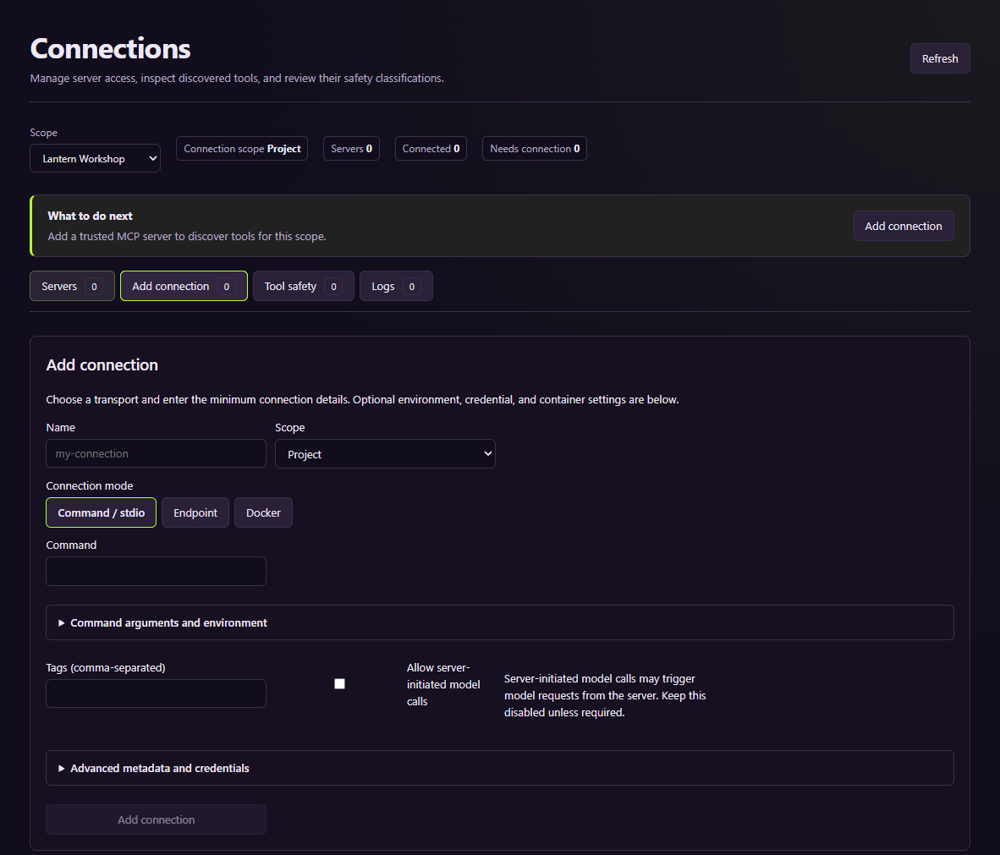

The **Servers**, **Add connection**, **Tool safety**, **Logs**, and **A2A agents** sections separate MCP server setup, external-agent connectivity, tool policy, and diagnostics. Select platform scope or a Project for MCP. Configure the connection name, tags, and execution mode. Expand **Command arguments and environment**, **Custom request headers**, **Advanced metadata and credentials**, or **Advanced Docker settings** when those inputs apply. Save the MCP connection, then explicitly connect it; inspect negotiated capabilities, classify discovered tools, and review logs in their sections.

Use a slug such as `lantern-editor`; names follow `^[a-z0-9][a-z0-9-]{0,63}$`. Supply arguments/environment in the shapes requested by the form, not a pasted shell command with accidental quoting. Use credentials controls for secrets. Docker additionally needs an available runtime and deliberately configured mounts/network.

An MCP server being connected means transport/protocol readiness. It does not prove that an editor has the correct game open. For live engine use, bind the Project and verify a read-only identity probe. Server-initiated input or model requests have their own policy/settings. Keep connection and tool-call identifiers when reporting failures.

The **A2A agents** view is separate from MCP: outbound JSON-RPC v1.0 agents are configured with static API-key/bearer/basic/custom-header credentials, discovered Agent Cards are untrusted input, and delegation is brokered. The builtin coordinator role has `a2a/*` by default; other roles require an explicit tool grant. The optional inbound gateway binds only to `127.0.0.1`. Register each local harness with explicit Project/role/task-operation grants and issue a bearer token; the plaintext is shown once, while the service retains only its hash. Inbound tasks retain the TaskService, access-mode and Ask-always approval boundaries. Remote/LAN inbound access, OAuth/OIDC, gRPC, webhooks and non-text request parts are unsupported.

## Engine

Select the Project, detect/register installations, and refresh capabilities after adding native files. An installation identifies a tool executable/kind/version. A capability report describes the current Project's usable operations. A live binding identifies the connected editor. The three layers are **project-file**, **headless-process**, and **live-editor**.

For Lantern Workshop, `game/project.godot` supplies native Project files. A headless operation still requires the correct executable and version. A live screenshot or edit still requires an implemented, connected, identity-verified bridge. The tutorial does not install an engine or create that bridge.

For Unreal, put the `.uproject` under the PlayWeld Project's `game/` folder and register the appropriate commandlet/automation executables. For Unity, provide valid native Unity Project files and its installed editor. Consult the [integration guide](INTEGRATION_GUIDE.md) and [live engine acceptance](LIVE_ENGINE_ACCEPTANCE.md) for the actual implemented connectors and fixture limits.

Before running an operation, inspect the layer and its reason/status. After running, inspect the run state, logs, exit code, and artifacts. A successful screenshot operation must supply a storable image. A visible editor window or registered executable is not sufficient evidence.

## DCC Tools

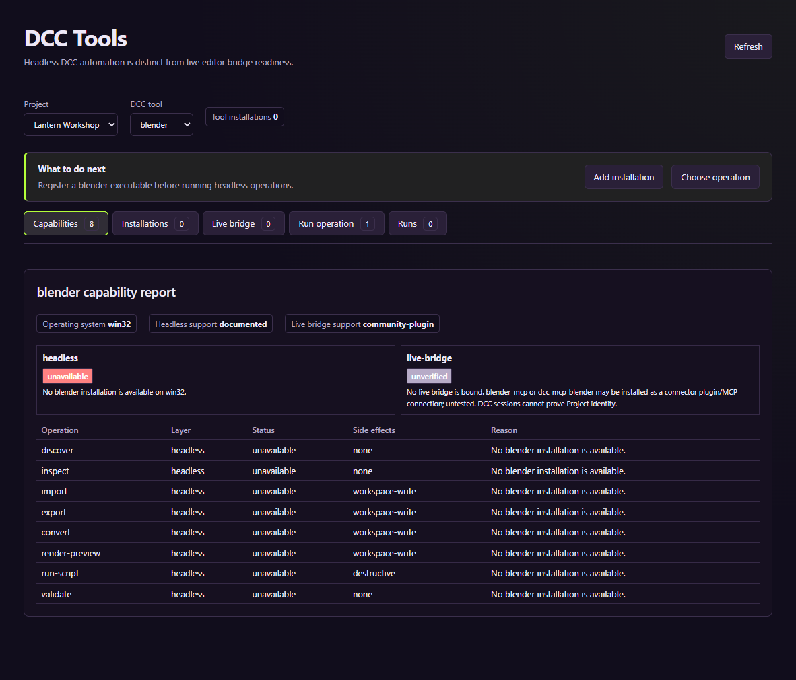

Detect or register the installed DCC tool and executable kind, select the Project, and inspect its supported operations. GUI, batch, and Python executables can have different behavior. Inspect run history and artifacts after scene/export/render operations.

For an asset task, specify the editable source, units, axes, origin, expected dimensions, export format, material paths, and validation target. A render illustrates appearance; a successful export establishes file creation. Engine import and gameplay suitability require additional checks. Blender has separate live fixture evidence; this screen capture does not execute Blender or verify other DCC products.

## Assets

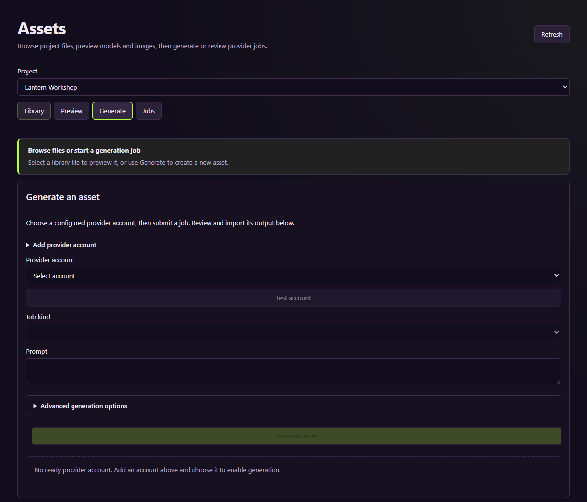

The **Library**, **Preview**, **Generate**, and **Jobs** sections separate stored files, inspection, requests, and job lifecycle. Configure a provider account in the expandable account form, choose a supported generation operation, and describe the intended asset, format, scale, references, and use. **Advanced generation options** reveals optional inputs. Job submission, provider completion, downloaded artifact, review, and import are distinct stages. Inspect terminal state and files rather than assuming a submitted request finished.

Preview 2D or 3D output, then validate dimensions, topology, UV/materials, rig/animation if applicable, provenance, and licensing needed for the use. Human review through `asset/review` must approve an artifact before `asset/import`; that review is a user-only service action. Imports preserve provenance and existing files, allocating a fresh filename on collision rather than overwriting the original. Outside-Project destinations are rejected. The [asset workflow screenshots](WORKFLOW_SCREENSHOTS.md#synthetic-asset-review-and-import-recovery) show actual review/import with a local synthetic artifact.

Example request: “A stylized lantern prop, upright, centered at its base, intended for a 0.4 m tall collectible; deliver source texture/material files and a mesh suitable for inspection.” The preview is a candidate until validated in its target engine. See the [integration guide](INTEGRATION_GUIDE.md) for provider-specific boundaries. This tutorial submits no paid jobs.

## Plugins

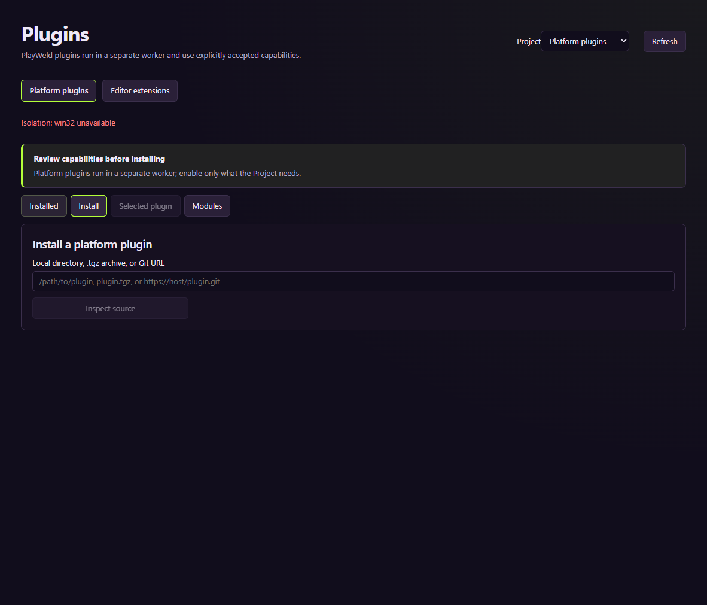

The platform-plugin page sections are **Installed**, **Install**, **Selected plugin**, and **Modules**; editor extensions are a separate plugin type/view. Inspect plugin type, source, version, declared capabilities, granted permissions, settings, and enabled state. Platform plugins have a manifest/runtime distinct from compiled Theia extensions and VS Code-compatible editor plugins. They cannot become owners of task/Project/router state.

Install only after reviewing the proposed privileges and compatibility. Project activation can differ from platform installation. Inspect plugin panels/tools and runtime errors separately. Removing a plugin can remove its contributed tools/settings/panels; consider retained records and dependent tasks before uninstalling. The [plugin SDK/integration guide](INTEGRATION_GUIDE.md) describes implementation contracts.

## Backups

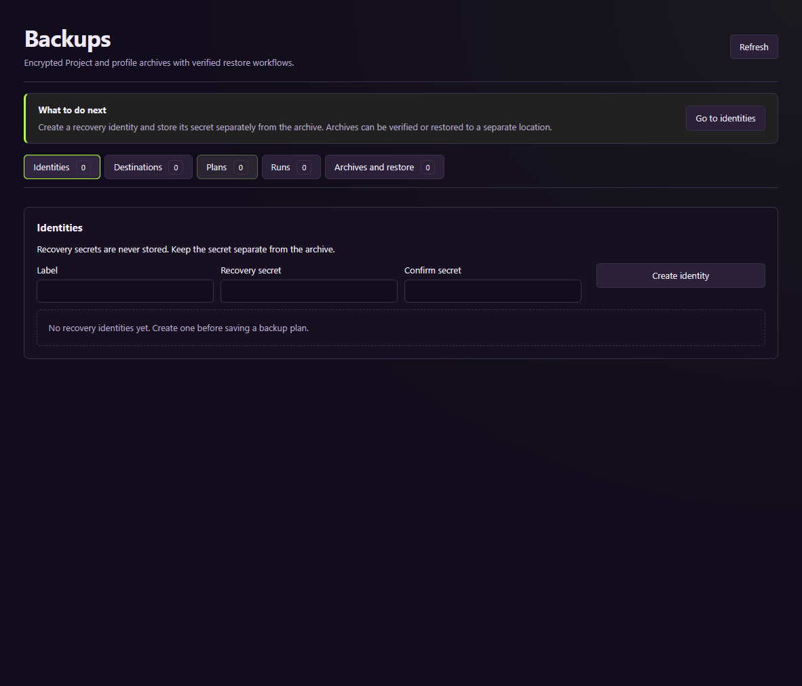

Use the **Identities**, **Destinations**, **Plans**, **Runs**, and **Archives and restore** sections in order. Configure recovery material and a destination, then a profile or Project plan. Review schedule, retention, and scope before running it. A configured plan is not an archive. Inspect transfer, verification, run failure/cancellation, archive manifest, and recoverability.

For a learning exercise, use a local destination and the disposable Project. Verify an archive, then restore to a new empty directory. Inspect restored Project identity, registration warnings, representative files, settings, and engine behavior. Keep the recovery secret available independently. Profile restoration requires launching the service with the restored profile; it does not overwrite the active profile in place.

The [operations guide](OPERATIONS_GUIDE.md#backups-and-restoration) gives recovery details. The original overview image above captures setup only. The later [UI restoration drill](WORKFLOW_SCREENSHOTS.md#local-backup-restoration) verifies local archive recovery, and the [profile runbook](RECOVERY_RUNBOOK.md) verifies launching a separately restored profile. Remote and installer recovery remain unverified.

## Updates

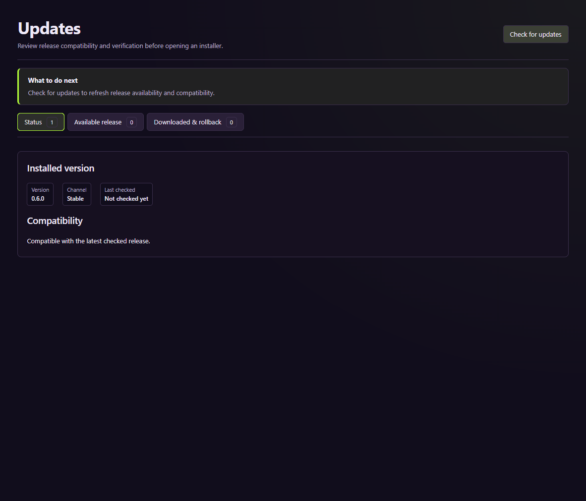

Check the offered version, channel, platform, compatibility, and verification result. Release discovery, download, checksum verification, signature verification, installer handoff, installed launch, and rollback are separate outcomes. Review the [release guide](RELEASE_GUIDE.md) and [release acceptance](RELEASE_ACCEPTANCE.md) before treating an offered update as accepted.

A checksum proves agreement with the supplied digest. Signature verification additionally requires a provisioned trusted key and valid signature. This tutorial does not install, publish, or roll back a release. Source package version shown in a screenshot is not an installer acceptance claim.

## Audit and history

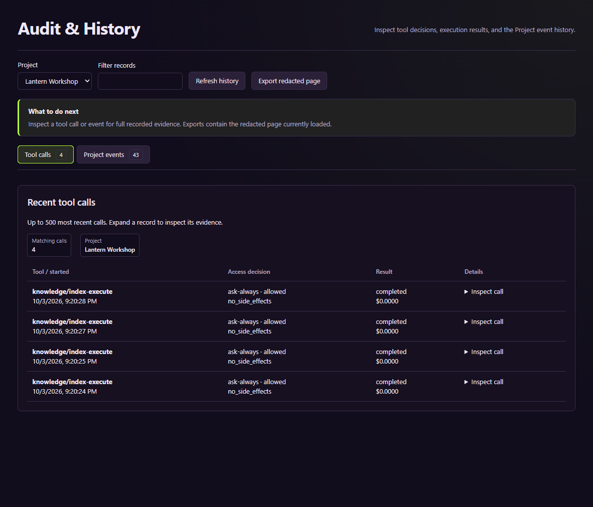

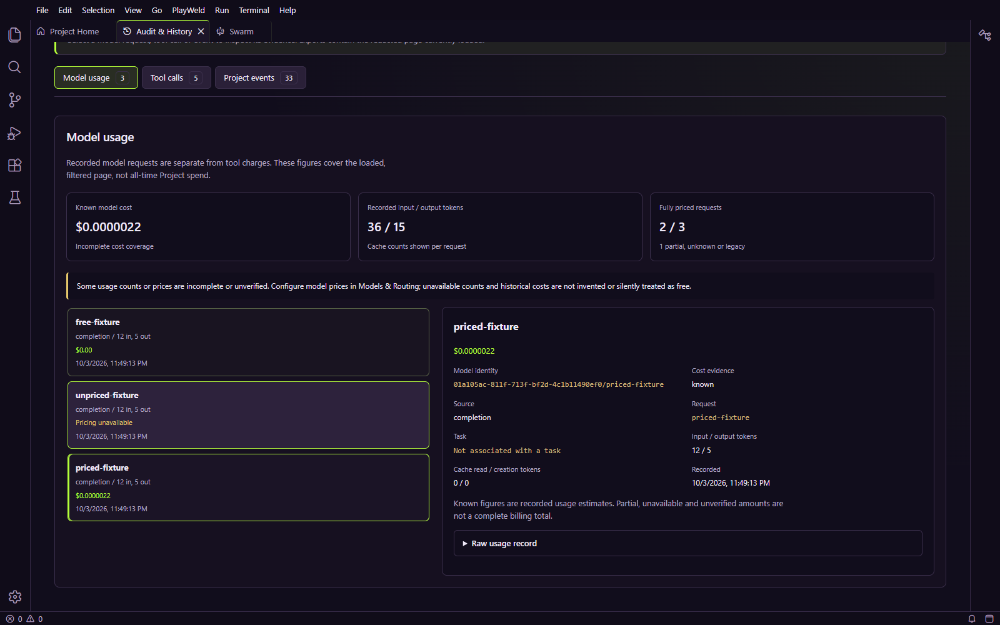

Select the Project, then choose **Model usage**, **Tool calls**, or **Project events**. Search the loaded records and select a card to inspect its details. Structured event context is bounded; full redacted records remain available in disclosures. Use identifiers, timestamps, effect classification, approval result, execution status and errors to connect a visible symptom to the actual operation. Pagination/export shows the loaded page; it is not a complete forensic or billing history.

Model usage records input/output and cache counters independently of tool charges. Small positive estimates remain visible rather than rounding to `$0.0000`. An explicitly priced zero is distinct from **Pricing unavailable**, **partial** usage and **Legacy cost unverified**. Legacy rows cannot establish missing prices, and older direct completions that were never persisted in the usage ledger may be absent. New routed/direct completion attempts are recorded at the shared boundary; failed attempts with unavailable usage remain unknown, not confirmed free.

The cost summary covers the **loaded, filtered model page**. Its known subtotal excludes unverifiable amounts; partial estimates retain an unpriced remainder. Do not add a model request and its linked model-tool charge as separate independent expenses. Configure input/output rates in Models & Routing before relying on estimates. Cache usage without recorded cache pricing remains partial/unknown rather than silently charged at an invented rate. Estimates are not provider invoices, subscription fees or hardware costs; task monetary accumulators/budget comparisons track known amounts and cannot establish a real hard-dollar ceiling for unpriced usage.

Current captures show [compact model-cost cards](images/audit-detail-2026-10-04/model-cost-narrow.png), [separate tool activity](images/audit-detail-2026-10-04/tool-history-desktop.png) and a [focused event timeline](images/audit-detail-2026-10-04/event-history-desktop.png). The fixture explicitly configures tiny, unknown and zero rates on localhost; those numbers are not production provider prices or private-profile screenshots.

Useful failure report: “Project ID/path, task/run/call ID, operation, version, exact error, expected outcome, and sanitized reproduction.” Link logs and artifacts. Never include service tokens, encryption/recovery secrets, provider credentials, or private Project contents without reviewing them.

## How the records fit together

The desktop/frontend presents service-owned data. The service owns persistent Project, task, discussion, routing, integration, and audit records. Engine/DCC processes own their native documents and runtime state. Plugins contribute supported capabilities. External providers own their remote job/completion state.

Follow the chain from request to task/tool run to artifact to validation to integration/acceptance. Each stage can fail independently. The [system architecture](SYSTEM_ARCHITECTURE.md) explains component and storage ownership; the [developer guide](DEVELOPER_GUIDE.md) explains contracts and implementation rules. Use those guides for internals instead of guessing from a screen's success message.

## Screenshot evidence

Screenshots use a real isolated service and the built development browser target. The capture report records browser/service version 0.6.0 on 2026-10-04, a local deterministic Chat fixture, and zero renderer errors. Configuration screens with empty tables are intentional: this test does not provision paid providers, backup accounts, DCC applications, or live engine bridges. The chat provider is explicitly a scripted local fixture. These images are not evidence for the later 0.7.0 package, a paid model, or a live engine/editor.
