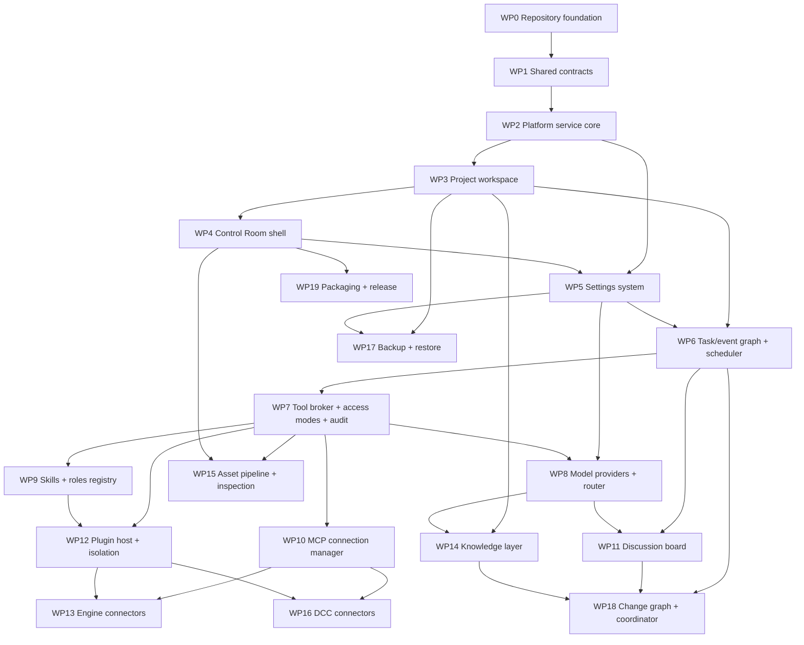

# PlayWeld Development Plan: Work Packages by Dependency

**Status:** Living plan. Ordering below is **technical dependency**, not product phasing: a work package appears after the packages whose interfaces it consumes. Every package targets the complete system described in [PLATFORM_DESIGN.md](PLATFORM_DESIGN.md); none of them is a milestone, release, or "first game".  
**Last updated:** 2026-10-02
**Related records:** [technical architecture](TECHNICAL_ARCHITECTURE.md), [decision register](OPEN_DECISIONS.md), [skills, roles, and tools](SKILLS_AGENTS_AND_TOOLS.md).

Each work package lists the design sections and register entries it implements, its hard dependencies, its "done when" criteria, and its current status. Status values: **Not started**, **In progress**, **Implemented (unit/integration-tested)**, **Verified (live)**. Only behaviour covered by tests in this repository may be marked Implemented; connectors reach Verified only after tests against the real engine, tool, or server.

**Product identity:** The PlayWeld public rebrand and 0.1.4 visual/package handoff are recorded in [branding](BRANDING.md) and [release notes](releases/v0.1.4.md); existing work-package evidence boundaries remain in force.

## Dependency graph

## Work packages

### WP0 — Repository foundation

- **Implements:** P01 (name), P02 (license), Q03 (start of reproducible builds).
- **Depends on:** nothing.
- **Scope:** Git repository, Apache-2.0 `LICENSE`/`NOTICE`, npm workspaces + Turborepo, shared `tsconfig.base.json`, ESLint/Prettier, Vitest, CI matrix (Ubuntu + Windows, Node 24) for packages plus an Ubuntu-only Theia browser build job.
- **Done when:** `npm ci && npx turbo run build typecheck lint test` is green on both CI runners.
- **Status:** Implemented (unit/integration-tested) in this repository; the CI workflow file exists but has not yet run on a hosted runner.

### WP1 — Shared contracts (`@gamecrafter/contracts`)

- **Implements:** W01 (manifest), W06 (settings scope shape), A01 (record schemas only), RPC envelope and method table, error codes, schema versioning rule (`schemaVersion` on every persisted record and message).
- **Depends on:** WP0.
- **Scope:** TypeBox schemas with derived TypeScript types and one Ajv validator factory; UUIDv7 IDs; Project manifest v1 (`gamecrafter.project.json`); `session/hello`, `service/info`, `project/create|list|open|get`, `project/changed`.
- **Done when:** every schema has accept/reject tests and every RPC method has params and result schemas.
- **Status:** Implemented for the slice above. Task/event and settings schemas beyond the scope enum are Not started.

### WP2 — Platform service core (`@gamecrafter/platform-service`)

- **Implements:** [TECHNICAL_ARCHITECTURE "Local API"](TECHNICAL_ARCHITECTURE.md#engineering-defaults-for-remaining-technology-choices), W05 (profile schema and migrations).
- **Depends on:** WP1.
- **Scope:** daemon lifecycle (`gamecrafter-service start|stop|status`, single-instance lock), Unix-socket/named-pipe JSON-RPC with per-install token, precompiled schema validation on every request and result, global profile SQLite (`node:sqlite` behind one seam) with forward-only migrations, structured logging.
- **Done when:** the integration test authenticates, rejects a bad token, and exercises every method; the CLI round-trips start/status/stop.
- **Status:** Implemented (unit/integration-tested). Native Windows named-pipe integration now exercises authentication, Project lifecycle, chat persistence, session settings, tasks, broker approvals, board maintenance, knowledge, and coordination. The CI quality matrix now runs the full suite on both OS targets. A real CLI regression verifies authenticated, checkpointed stop and lock cleanup, including Windows where SIGTERM bypassed orderly shutdown. See [local review and live-test evidence](PROGRAM_REVIEW.md) and [current repairs](FULL_PROJECT_REVIEW.md).

### WP3 — Project workspace

- **Implements:** W01, W02 (engine family immutable; preferred version recorded), W05 (Project schema), [SKILLS_AGENTS_AND_TOOLS §5](SKILLS_AGENTS_AND_TOOLS.md#5-project-folder-additions). W03 (clone).
- **Depends on:** WP2.
- **Scope:** `project/create` writes the folder layout (`gamecrafter.project.json`, `docs/`, `game/`, `.gamecrafter/{project.sqlite,logs,cache}`, `.agents/skills/`, generated `AGENTS.md`, `.gitignore`), runs Project migrations, initialises a Git repository with one commit, appends a `project.created` event, and registers the Project in the profile; `open`, `get`, `list`; rollback of a partially created folder on failure.
- **Done when:** integration test asserts the folder contents, migrations, Git history, and registry behaviour; clone produces an independent Project with a new ID and reset remotes.
- **Status:** Implemented (unit/integration-tested): create/open/get/list and clone (Git history kept, remotes removed, new Project ID, `cloned_from` recorded). The 2026-10-01 review adds SQLite-consistent snapshots, transactional ownership rewrites including nested JSON and chat history, cleared derived indexes and live bindings, excluded source worktrees, and cancellation of copied active work/approvals. Source histories and settings stay independent; nested clone targets are rejected. See [full project review](FULL_PROJECT_REVIEW.md).

### WP4 — Control Room shell (`apps/control-room`, `packages/theia-control-room`)

- **Implements:** U01 (partial: Project Home as the landing surface), U02 (partial: guided create flow with engine-lock warning), [PLATFORM_DESIGN "Interface foundation"](PLATFORM_DESIGN.md#interface-foundation-eclipse-theia-selected).
- **Depends on:** WP3.
- **Scope:** Theia 1.75 Electron application (desktop product) and a development-only browser target; backend bridge that discovers or spawns the platform service and reconnects; Project Home view (service status, Project table, Create Project); six-step Quick Input create flow; VS Code builtin plugins (Git, merge-conflict, themes, language basics) downloaded at build time.
- **Done when:** Electron and browser builds succeed; the browser target lists and creates Projects through the service; Electron starts under a desktop session.
- **Status:** Implemented. Browser target exercised end to end (Project created through the UI); Electron build and 25-second launch smoke test passed under WSLg; Repeatable browser and native Windows Electron UI smoke tests now cover service connection, the Project creation wizard, thirteen Control Room views, and opening the Project in the same window through `scripts/live-ui-smoke.cjs`. Project Home wraps its navigation and scrolls in narrow docks. See [local review and live-test evidence](PROGRAM_REVIEW.md).

### WP5 — Settings system

- **Implements:** W06, U03, [PLATFORM_DESIGN proposal 11](PLATFORM_DESIGN.md#proposed-architecture-for-discussion).
- **Depends on:** WP2, WP4.
- **Scope:** typed settings schema registry in contracts; platform → Project → session precedence with effective-value and source; `settings/get|set|describe` RPC; Theia settings pages grouped as proposed (no single long page); plugin-contributed settings schemas.
- **Done when:** precedence and null-versus-inherit rules are tested; the UI shows effective value and scope for every setting.
- **Status:** Implemented (unit/integration-tested): registry with 17 groups and 75 builtin definitions, `settings/describe|get|getAll|set|export|import`, platform → Project → session precedence with per-connection sessions, and the PlayWeld Settings view (group pages, search, schema-driven controls, source badge, scope selector, reset-to-inherit). Plugin-contributed definitions register/unregister with their plugin; a schema-versioned redacted export is available through RPC and Settings. Project settings copy with clone and Project backups; platform settings copy with profile backups; session values remain ephemeral. Settings import previews a validated merge, skips unknown/redacted values, and applies the selected scope atomically; plugin setting migration remains open.

### WP6 — Task/event graph and scheduler

- **Implements:** A01, A02, A05, W07, [TECHNICAL_ARCHITECTURE "Agents and tasks"](TECHNICAL_ARCHITECTURE.md#recommended-core-stack).
- **Depends on:** WP3, WP5.
- **Scope:** append-only events with current-state projections; parent/child lineage, dependencies, priorities, leases, checkpoints, cancellation, completion evidence; supervised worker processes with idempotency keys; window-close behaviour (continue or stop/checkpoint) from Settings; restart reconciliation.
- **Done when:** crash-recovery tests restart the service mid-task and reconcile without duplicating side effects.
- **Status:** Implemented (unit/integration-tested): task records with explicit state machine, append-only events, dependencies (ready/blocked), goal-hash deduplication, depth and concurrency limits from Settings, forked worker processes with heartbeats/leases, checkpoint resume, retries, questions/answers, cancel cascade, `service/stop` with checkpoint, and restart reconciliation. Only `noop.*` handlers exist until the agent runtime (WP8/WP9) registers real ones; there is no task UI yet (U04).

### WP7 — Tool broker, access modes, and audit

- **Implements:** S01, S09, [SKILLS_AGENTS_AND_TOOLS §4.2](SKILLS_AGENTS_AND_TOOLS.md#42-capability-metadata-and-per-operation-execution-mode), [PLATFORM_DESIGN proposal 10](PLATFORM_DESIGN.md#proposed-architecture-for-discussion).
- **Depends on:** WP6.
- **Scope:** tool registry with `execution-mode`, `side-effects`, and `evidence` metadata; Full/Restricted/Ask-always applied at execution with ceiling inheritance; question path for approvals; immutable audit log with secret redaction.
- **Done when:** tests prove Full executes without gates, Restricted denies outside the allowlist, Ask always prompts for side effects, and spawned scopes never exceed the parent.
- **Status:** Implemented (unit/integration-tested): tool registry with execution-mode/side-effect/evidence metadata, six builtin tools with Project path containment, broker decisions for all three modes with ceiling composition (`min` of session mode, request ceiling, and task ceiling), restricted side-effect and tool-glob allowlists, Ask-always approvals with timeout and restart recovery, redacted `tool_calls`/`approvals` audit tables, `tool.called` events, worker-side `ctx.tool()`, and Approve/Reject prompts in the Control Room. The Audit & History view reads redacted Project events with sequence pagination and recent tool calls, filters displayed records, and exports the displayed page. Prompt grouping and retention/deletion controls remain open (U04/S09).

### WP8 — Model providers, registry, and adaptive router

- **Implements:** M01–M10, [PLATFORM_DESIGN proposal 9](PLATFORM_DESIGN.md#proposed-architecture-for-discussion). M10's source correction uses [selected-model capacities and separate task budgets](TECHNICAL_ARCHITECTURE.md#model-capacity-and-task-budgets); live installed-provider acceptance remains separate.
- **Depends on:** WP5, WP7.
- **Scope:** provider/account adapter interface (stream, tools, structured output, embeddings, usage); OpenAI-compatible local endpoint adapter first; model catalog with timestamped metadata; pool intersection and deterministic eligibility; outcome store; quality-first selection policy with budgets, exploration, and policy versioning; Theia AI bridged through one adapter `LanguageModel`.
- **Done when:** eligibility tests cover empty-intersection reporting; router decisions record candidate set, reason, and outcome.
- **Status:** Implemented (unit-tested against fake HTTP providers; no live provider yet): encrypted credential store, provider accounts, OpenAI-compatible and Anthropic adapters (chat, tools, streaming, embeddings where supported), model catalog with discovery and manual overrides, per-model work-type/role eligibility, agent/task-type pools with intersection and empty-set reporting, quality-first/balanced/cost-first scoring from recorded outcomes, budgeted exploration, `model/complete`/`model/embed`, the Models & Routing view, and a Project-scoped Control Room chat with persisted conversations, streamed router responses, optional editor-context attachment, and an Agent-mode handoff to Swarm. The native Theia AI `LanguageModel` adapter, in-chat tool execution, manager model for task classification, and online benchmark ingestion remain open.

### WP9 — Skills and roles registry

- **Implements:** [SKILLS_AGENTS_AND_TOOLS §2–3](SKILLS_AGENTS_AND_TOOLS.md#2-skills), A03, S06–S08.
- **Depends on:** WP7.
- **Scope:** Agent Skills loader with `gamecrafter-*` metadata validation; install sources matching the `skills` CLI; Project enablement and eligibility; three-tier catalog with `activate_skill` and `search_skills` broker tools; `ROLE.md` role packages with access ceilings.
- **Done when:** a community skill installs unchanged, the eligible set is computed deterministically, and activations are recorded per task.
- **Status:** Implemented (unit/integration-tested): Agent Skills loader and validator, install sources (local path, `owner/repo`, Git/tree URLs, `.tgz` archives, direct `SKILL.md`; skills.sh packs deferred to the optional proxy plugin) with size caps, platform install + per-Project enablement/eligibility overrides + Project-local and compatibility-scan discovery with shadowing events, Project trust flag, deterministic catalog with success/lexical/recency ranking, `skills/activate` wrapper and activation records, `skills/search`, tier-3 read access to skill directories, eleven builtin `ROLE.md` roles with platform/Project overrides, and the Skills & Roles view. The [30-skill bundled game-development library](GAME_DEVELOPMENT_SKILLS.md), default Project enablement, installed/Project override precedence, bounded `skills/read-resource` RPC/broker reads and the Control Room guide reader expand the registry. Library metadata, packaging, role coverage and reference access are covered by automated tests; workflow evaluations are separate from live engine/DCC validation. Dynamic per-task activation enums and compaction protection are covered by WP18.

### WP10 — MCP connection manager

- **Implements:** C01, C02, [SKILLS_AGENTS_AND_TOOLS §4.1](SKILLS_AGENTS_AND_TOOLS.md#41-mcp-connection-manager-resolves-c01-policy); follows the `mcp-multiversion-client` skill.
- **Depends on:** WP7.
- **Scope:** connection records (`command | endpoint | docker`), `server/discover` probe with `initialize` fallback across revisions 2025-03-26 through 2026-07-28, deprecated-feature policy, MRTR/elicitation to the broker question path, tool caching and namespacing.
- **Done when:** contract tests pass against fixture servers for each revision, including the fallback and unsupported-version paths.
- **Status:** Implemented (unit/integration-tested against in-repo fixture servers; no live community engine/DCC server yet): platform's own JSON-RPC layer over stdio, Streamable HTTP, and legacy SSE transports (the official SDK is a dev-only dependency used for 2025-era fixture servers); `server/discover` probe with `initialize` fallback on method-not-found or pre-initialization HTTP 4xx; unsupported-version rejection (`-32022`, single `initialize` attempt); per-revision headers (`Mcp-Session-Id`, `MCP-Protocol-Version`, `Mcp-Method`/`Mcp-Name`); tool-list caching with `ttlMs`/`list_changed`/`subscriptions/listen`; MRTR `input_required` and `elicitation/create` through the task-question path or a Connections Quick Input; sampling refused by default and routed through the model router with cost accounting when enabled; `roots/list` scoped to the Project folder; Docker mode via the `docker` CLI (tested with a fake binary; the HTTP port-mapping path is untested); encrypted `${cred:KEY}` references isolated per connection and redacted from logs; namespaced broker registration with annotation-derived side effects, dangerous-name override, and user classification; the Connections view. The 2025-03-26/06-18 fixtures rewrite the SDK's negotiated revision and do not reproduce every historical server detail.

### WP11 — Discussion board and maintenance agent

- **Implements:** A08, A09, K06, [PLATFORM_DESIGN proposals 7–8](PLATFORM_DESIGN.md#proposed-architecture-for-discussion).
- **Depends on:** WP6, WP8.
- **Scope:** threads, typed messages, subscriptions, binding-decision events with immutable history; decision-to-record synchronisation workflow; configurable maintenance agent (immediate on binding decisions, periodic audits, archive-not-delete default).
- **Done when:** a binding decision produces a reviewable canon diff and the board item is marked synchronised only after success.
- **Status:** Implemented (unit/integration-tested; maintenance model calls tested against the fake provider only): Project-local threads, typed immutable messages with edit history and single supersession, per-thread sequence numbers, FTS5 search, subscriptions, user-only binding (agents propose through `board/propose-decision`), archive-not-delete with a setting-gated permanent delete, the idempotent decision-to-record workflow (`docs/decisions/<date>-<slug>.md` written through the tool broker under the Project's access mode, link validation, Git commit, `synchronized` only after the commit, conflict detection when a record belongs to another decision or changed outside the workflow), supervised `board-maintenance.sync|audit|cleanup` tasks with schema-validated model verdicts, the periodic scheduler, `board/read|post` broker tools with role allowlist checks, and the Discussion Board view. The proposal diff is a whole-file replacement diff, canon reconciliation beyond decision records waits for WP14, and role tool allowlists are enforced per tool rather than centrally in the broker (to be consolidated in WP18).

### WP12 — Plugin host and isolation

- **Implements:** S02 (Verify), S04, S05, K01 (module/genre-pack manifests as plugin types), [TECHNICAL_ARCHITECTURE "Plugin and connector contract"](TECHNICAL_ARCHITECTURE.md#plugin-and-connector-contract).
- **Depends on:** WP7, WP9.
- **Scope:** versioned plugin manifest; language-neutral worker protocol with a TypeScript SDK; Windows AppContainer + Job Object and Linux bubblewrap + Landlock/seccomp launchers; fail-closed behaviour for Restricted/Ask-always; unified Plugins catalog UI showing type and privilege boundary.
- **Done when:** adversarial escape tests pass on both OS targets (until then S02 stays Verify).
- **Status:** Implemented (unit/integration-tested; Linux isolation adversarially tested in this repository, Windows unverified): `gamecrafter-plugin.json` manifest v1 with capabilities, contributions (tools, modules, genres, roles, skills, settings, declarative panels), dependencies and compatibility ranges; installer (local dir, `.tgz`, Git) with sha256, `unsigned` signature status, capability review before install, platform install plus per-Project enablement; language-neutral newline JSON-RPC worker protocol (shared IPC layer with the MCP client) with a TypeScript SDK (`@gamecrafter/plugin-sdk`), a first-party `sample-hello` plugin, and a Python fixture worker; brokered host API (`host/tool/call`, model completion with usage accounting, namespaced secrets, board access) gated per granted capability and audited; supervised workers with restart limits; `bwrap` launcher (user/pid/net/ipc/uts/cgroup namespaces, cleared environment, Project folder never mounted) whose probe and adversarial escape tests pass here (Project and repository reads, `$HOME` writes, and network denied unless granted); AppContainer launcher reports unavailable so Restricted/Ask-always fail closed on Windows; module/genre composition with conflict reporting; the Plugins catalog view. Not done: plugin signature verification (S06), host-level egress filtering (plugins requesting a `hosts` allowlist fail closed), Landlock/seccomp layering, the Windows AppContainer implementation.

### WP13 — Engine connectors

- **Implements:** C03, C04 (Verify), [SKILLS_AGENTS_AND_TOOLS §4.3](SKILLS_AGENTS_AND_TOOLS.md#43-engine-connectors-implements-c03-informs-c04).
- **Depends on:** WP10, WP12.
- **Scope:** capability report separating `project-file`, `headless-process`, and `live-editor` readiness; Unity, Unreal, and Godot headless/CLI layers; live MCP bridges as connector plugins; per-engine capability matrix tests.
- **Done when:** each connector's contract tests pass and live operations are recorded against a verified editor session per engine and OS.
- **Status:** Implemented (Godot headless layer tested against a real Godot 4.7.2 binary in this repository; Unity 6000.6.0f1 and Unreal 5.8.3 live-tested on Windows with disposable fixtures, test-result validation, access approvals/denials, Win64 packaging and built-player assertions; official Unity and adapted Unreal live editor identity and screenshots accepted): C03 capability report with separate `project-file`/`headless-process`/`live-editor` layer statuses, file-based Project identity proof (`project.godot`, `ProjectVersion.txt`, `.uproject`), installation detection plus manual registration, per-operation availability with reasons, brokered `engine/*` operations with persisted runs and log artifacts under `.gamecrafter/engine-runs/`, preferred-version mismatch reporting to the board, live bridge binding to a WP10 MCP connection tagged `live-editor` whose readiness requires a connected session and a read-only identity probe matching the Project, and the Engine view. See [live acceptance](LIVE_ENGINE_ACCEPTANCE.md) for the exact accepted fixture matrix. See [extended acceptance](EXTENDED_ENGINE_ACCEPTANCE.md) for Unity Windows/Linux/WebGL graphics and audio, browser input, Unity brokered MCP, CodeFizz editor operations and brokered screenshots through the acceptance adapter, Unreal audio and Linux commandlet checks. C04 stays Verify for physical desktop input, other engine bridge bindings, production Projects and the complete operation matrix.

### WP14 — Knowledge layer

- **Implements:** K03, R01–R05, [PLATFORM_DESIGN proposal 2](PLATFORM_DESIGN.md#proposed-architecture-for-discussion).
- **Depends on:** WP3, WP8 (embeddings).
- **Scope:** canon record format with stable IDs and typed front matter; SQLite FTS5 index; Qdrant read/write adapter behind a versioned vector-store interface with Project namespaces; incremental indexer and reconciler; retrieval with file, revision, record ID, and quote-span citations.
- **Done when:** index rebuild from source is idempotent and cross-Project leakage tests pass.
- **Status:** Implemented (unit/integration-tested; embeddings tested against the fake provider only; the Qdrant adapter is tested against a Docker-run Qdrant when `docker` is available, otherwise that suite is skipped): canon record format with dotted stable IDs, eleven builtin record types plus plugin-contributed `recordTypes`, typed front matter (status `draft|proposed|accepted|deprecated|retconned`, typed references with confidence and source, provenance, `schemaVersion`), duplicate-ID and unknown-type reporting; `canon_records`/chunks/FTS5 tables in the Project database; index sources `canon|decisions|docs|code|board|assets|inactive` with Settings-gated code/board indexing; Git-aware incremental indexer (`ls-tree`/`status` revision detection, file watchers with debounce, periodic reconciliation, deterministic point IDs, stale-chunk deletion); per-Project embedding profiles pinned to model/provider/dimensions with versioned rebuild when the profile changes; versioned `VectorStore` interface with a Qdrant adapter that enforces the Project ID on every upsert/delete/query and refuses foreign-Project vectors; hybrid reciprocal-rank retrieval favouring accepted canon with file path, revision, record ID, and quote-span citations, degrading to lexical when semantic search is unavailable; supervised `knowledge.reindex|reconcile` tasks; `knowledge/*` RPC methods and broker tools; reference graph; and the Knowledge view. Idempotent-rebuild and cross-Project leakage tests pass. Live embedding providers and any vector store other than Qdrant remain untested/absent.

### WP15 — Asset pipeline and inspection

- **Implements:** C06, C07, U05, [PLATFORM_DESIGN proposal 5](PLATFORM_DESIGN.md#proposed-architecture-for-discussion) (asset part).
- **Depends on:** WP7, WP4.
- **Scope:** typed asset job lifecycle; Meshy and Tripo3D adapters with recorded provenance; preview derivative generation (glTF/GLB); Three.js inspection view (orbit, animation, hierarchy, materials, LOD) and 2D viewer; "Open in authoring tool" action.
- **Done when:** a generated asset flows request → review → import with provenance, and the viewer inspects a fixture GLB.
- **Status:** Implemented (unit/integration-tested; Meshy and Tripo3D adapters tested against in-repo fake HTTP servers only, neither provider called live; the Three.js viewer exercised in a browser smoke test, automated UI smoke for view loading; broader workflow UI tests remain): typed asset job lifecycle (`queued → submitted → running → downloading → review → approved|rejected → imported`, plus `failed|cancelled|expired`) with an explicit transition table, per-Project `asset_jobs` and `asset_previews` tables and profile-level `asset_provider_accounts` with API keys in the encrypted credential store; Meshy and Tripo3D adapters behind a shared adapter interface with capability declarations, 429/`Retry-After` backoff, restart-resumed polling, capped streaming downloads with sha256, and provenance (provider, task ID, plan tier, request, timestamps, credits, terms snapshot, requester); user-only review through `asset/review` (no broker tool) before `asset/import` copies the artifact into `assets.importDirectory` with a `.gamecrafter-provenance.json` sidecar and never overwrites; preview derivatives under `.gamecrafter/cache/asset-previews/` (glTF 2.0/GLB header validation and metadata extraction, image header parsing, `unavailable` with warnings for glTF 1.0, Draco-only geometry, external glTF buffers, and DCC formats without a converter) with a size-bounded cache; `asset/*` RPC methods, `asset/generate|job|jobs|import|preview|files` broker tools (`asset/generate` is `paid`), `assets.*` settings, a Theia backend preview route with Project-path containment, and the Assets view with library, Three.js viewer (orbit, animation, hierarchy, materials, LOD levels, wireframe), 2D viewer, and Open in authoring tool. Tripo image jobs now upload PNG/JPEG references as multipart files and submit the returned token with an explicit model; conversion uses the documented GLTF selector for GLB, task errors include `error_message`, and balance uses the documented account route. These request contracts are [documentation-verified](research/asset-provider-api-verification.md) and HTTP-fixture-tested; live generation, `negative_prompt`, and headless conversion of DCC formats (WP16) remain open.

### WP16 — DCC connectors

- **Implements:** C05 (Verify), [SKILLS_AGENTS_AND_TOOLS §4.4](SKILLS_AGENTS_AND_TOOLS.md#44-dcc-and-generation-connectors-implements-c05c06-defaults).
- **Depends on:** WP10, WP12.
- **Scope:** headless adapters for Blender, Maya, 3ds Max, Cinema 4D, ZBrush where a documented CLI exists; live bridges as connector plugins; per-tool OS support matrix; code-execution tools labelled `destructive`.
- **Done when:** each adapter's capability report is verified against the real application on at least one supported OS.
- **Status:** Implemented (Blender headless adapter **verified live** against Blender 5.2.2 LTS — a Windows build run through WSL interop and directly on native Windows on this machine — for discover, run-script, inspect, export-to-GLB, and render-preview; Maya, 3ds Max, Cinema 4D, and ZBrush adapters tested against fake executables only; no live DCC MCP bridge tested; browser smoke of the DCC Tools view, automated UI smoke for view loading; broader workflow UI tests remain): per-tool capability report with separate `headless` and `live-bridge` layers and an OS support matrix transcribed from the research note (`DCC_SUPPORT_MATRIX`); installation detection (PATH, well-known directories, `dcc.searchPaths`, and WSL interop scanning of Windows installs with `wslpath` translation of every path argument) plus manual registration; operations `discover|inspect|import|export|convert|render-preview|run-script|validate` with per-operation availability and reasons, brokered as `dcc/*` tools (`run-script` is `destructive` and additionally rejects `subprocess`/`os.system`/`shutil.rmtree` unless `dcc.allowUnrestrictedScripts` is set); persisted runs and artifacts under `.gamecrafter/dcc-runs/`; live bridge binding to a WP10 MCP connection tagged `live-bridge:<tool>` whose readiness is a connected session with tools (DCC sessions cannot prove Project identity, which the report states); `dcc.*` settings and the DCC Tools view. C05 stays Verify for every tool except Blender-on-this-host; community bridges (blender-mcp, GG_MayaMCP, 3dsmax-mcp, mcp-cinema4d, dcc-mcp-zbrush) are listed as installable and untested.

### WP17 — Backup and restore

- **Implements:** B01–B06, [PLATFORM_DESIGN proposal 12](PLATFORM_DESIGN.md#proposed-architecture-for-discussion).
- **Depends on:** WP3, WP5.
- **Scope:** encrypted archives with manifest and integrity hashes; separate Project and profile scopes; destination adapters (local, FTP, S3, Google Drive, plugin); schedules and retention; restore into a new location first.
- **Done when:** automated restore drills verify hashes and open the restored Project/profile on both OS targets.
- **Status:** Implemented (unit/integration-tested; local destination exercised for real, S3/FTP/Google Drive tested against in-repo fake servers only — the fake S3 recomputes and checks SigV4 — no remote provider called live; browser smoke of the Backups view, automated UI smoke for view loading; broader workflow UI tests remain): `.gcbackup` archive format with per-archive random key wrapped by X25519 ECDH + HKDF to a backup identity whose private key is scrypt-protected by a user secret that is never stored (the identity material travels in the archive header, so restore needs only archive + secret); gzip payload in 1 MiB AES-256-GCM chunks authenticated with index and final-chunk flags (truncation, reordering, and tampering tests fail closed); a manifest preview in the first chunk for `backup/inspect` and an authoritative trailing manifest; SQLite-consistent snapshots via `VACUUM INTO` through the database seam; Project scope (whole folder incl. `.git` as files, excluding cache/logs/run/WAL and `backup.excludeGlobs`) and profile scope (profile DB snapshot, `credentials.key`, plugins, skills); `local`, `s3` (SigV4, single PUT), `ftp` (explicit TLS optional), and `google-drive` (refresh token, resumable upload) destinations with secrets in the credential store and a registry seam for plugin destinations; plans with manual/interval/daily schedules, fake-clock-tested scheduler with missed-run catch-up, retention that never prunes the newest verified archive and prunes nothing after a failed run; every run is verified by streaming the archive back and re-hashing, plus an optional decrypt-and-hash drill; restore only into a new empty location with per-file hash checks, symlink containment, Project-ID conflict handling (`restoredFrom` in the manifest) and profile restore activated by `GAMECRAFTER_PROFILE_DIR`; `backup/*` RPC methods, `backup.*` settings, and the Backups view. Not done: in-place replacement, plugin-contributed destinations, S3 multipart (single PUT limit applies), live remote destinations. Native Windows Project and profile restore drills, including credentials and an 8 MiB asset, now pass in backup-service.integration.test.ts; B06 remains Verify for the broader recovery matrix.

### WP18 — Change graph and swarm coordinator

- **Implements:** K05, A04, A06, A07, [PLATFORM_DESIGN proposal 6 and 13](PLATFORM_DESIGN.md#proposed-architecture-for-discussion).
- **Depends on:** WP6, WP11, WP14.
- **Scope:** cross-discipline impact graph; Git worktree allocation for independent code/docs tasks; resource locks and leases for live engine/DCC sessions; validation and completion contract; conflict detection and revalidation before integration; user feedback propagation.
- **Done when:** two concurrent tasks editing overlapping files are detected and reconciled without an unseen overwrite.
- **Status:** Implemented (unit/integration-tested; every model interaction uses the in-repo scripted fake provider — no live model has driven an agent; Git worktrees and merges are real; browser smoke of the Swarm view, automated UI smoke for view loading; broader workflow UI tests remain): typed change graph (`change_nodes`/`change_edges`) built from canon references, task touches/artifacts, tool-call audit rows, and lexical/scene inference with source and confidence per edge, idempotent rebuild, and bidirectional impact traversal with multiplicative confidence and a `needsValidation` flag below `coordination.impactConfidenceThreshold` (inferred edges are never written as canon); atomic ordered shared/exclusive resource locks with TTL, heartbeat renewal, release on task completion or lease expiry, user override, and broker pre-checks for live-editor engine operations, bound DCC bridges, asset imports, and declared file overlaps; the `agent.run` runtime (role snapshot, role tool allow/deny globs now enforced centrally in the broker, per-task `skills/activate` enum, pinned skill bodies through transcript compaction, `model/complete` via the router, `tasks/delegate|await|complete|ask_user`, `locks/*`, `memory/write`, ceiling inheritance, depth and budget limits, duplicate detection by goal hash plus write-touch overlap, checkpoint/resume without replaying tool calls, turn and budget stops); Project-local ignored Git worktrees per isolated task; completion contracts whose claims are checked against real engine/tool run records (unbacked claims downgraded, missing requirements fail the task); integration with concurrent-change, lock, declared-overlap, and dry-run merge conflict detection, `coordination.autoIntegrate` policy, access-mode gating through the broker, `--no-ff` merges only onto a clean Project branch, and automatic reconcile tasks on conflict; feedback (`accept|revise|reject`) with new attempts, impact-driven `validator` revalidation tasks, board posts on the request thread, and `git revert -m 1` integrations for rejected work; `change/*` RPC methods, `coordination.*` settings, and the Swarm view (first task/progress/cost/question UI). The "done when" scenario — two concurrent worktree tasks editing the same file, conflict detected, reconciled, both changes present, no unseen overwrite — is covered by `swarm-coordination.integration.test.ts`. This closes the deferrals from WP6 (real handlers), WP9 (activation enum, compaction protection), and WP11 (central role allowlists); Task-aware retrieval now boosts declared file/canon resources and goal matches, and budgets complete cited quotes using token estimates; binary-conflict strategies remain open.

### WP19 — Packaging and release

- **Implements:** P03, P04, Q03.
- **Depends on:** WP4.
- **Scope:** Windows and Linux installers, checksums/signing, update checking with user-controlled installation and rollback, tested distribution matrix.
- **Done when:** CI produces verifiable Windows and Linux packages from a tagged commit.
- **Status:** In progress: Electron Builder targets and a tagged Linux/Windows draft-release workflow are present. The update manager checks releases, filters by platform/schema compatibility, downloads to the profile with SHA-256 and optional Ed25519 checksum-signature verification, persists dismissal, and exposes user-facing controls. A configured trusted key now requires a valid published signature; missing signatures fail closed. Installation instructions reject incompatible saved state. Windows packaging rebuilds target-native modules, rejects a non-PE addon, and launches Theia's Electron main entry; the platform-service CLI is spawned in Electron Node mode. The E-drive app was verified to create and open a Project in the current window, and Project Home explains unavailable native engine layers. Hosted CI (run 36804234526) and the Linux/Windows package matrix (run 36804268127) passed. The [release guide](RELEASE_GUIDE.md) documents synchronized workspace/tag versions, versioned Windows output, checks for packaged skill assets/notices, and a draft testing-prerelease workflow that requires explicit unsigned authorization when no Ed25519 key is configured. Tagged signing and installation lifecycle acceptance remain open. The 2026-09-30 local review rebuilt an unsigned Windows NSIS installer and verified the packaged executable with sixteen live UI checks and zero renderer exceptions; see [program review](PROGRAM_REVIEW.md). The 0.1.1 native Windows test package passes version/skill/notice checks, runtime discovery of thirty bundled skills, activation/reference reading and 23 packaged UI checks; see [release acceptance](RELEASE_ACCEPTANCE.md). Installation remains manual; rollback package capture/restore is not yet implemented. Signing-key provisioning and installer/update/rollback drills remain incomplete. Do not mark WP19 implemented until those paths are tested.

## Cross-cutting rules

- Every repository task must include a permanent [work record](changes/README.md), generated changelog freshness and complete changed-file coverage. Version preparation collects the recorded details and validation into release notes and enforces the highest required version impact. This repository maintenance contract does not change work-package completion or live verification requirements.

- Genre packs and modules (K01, K02, K07) are plugin types (WP12) whose records live in the knowledge layer (WP14).
- Every work package adds contracts to `@gamecrafter/contracts` under a new or bumped `schemaVersion`; existing versions are never rewritten.
- When a work package changes status, update this file, the register entries it resolves, and the corresponding design/architecture sections in the same change.
