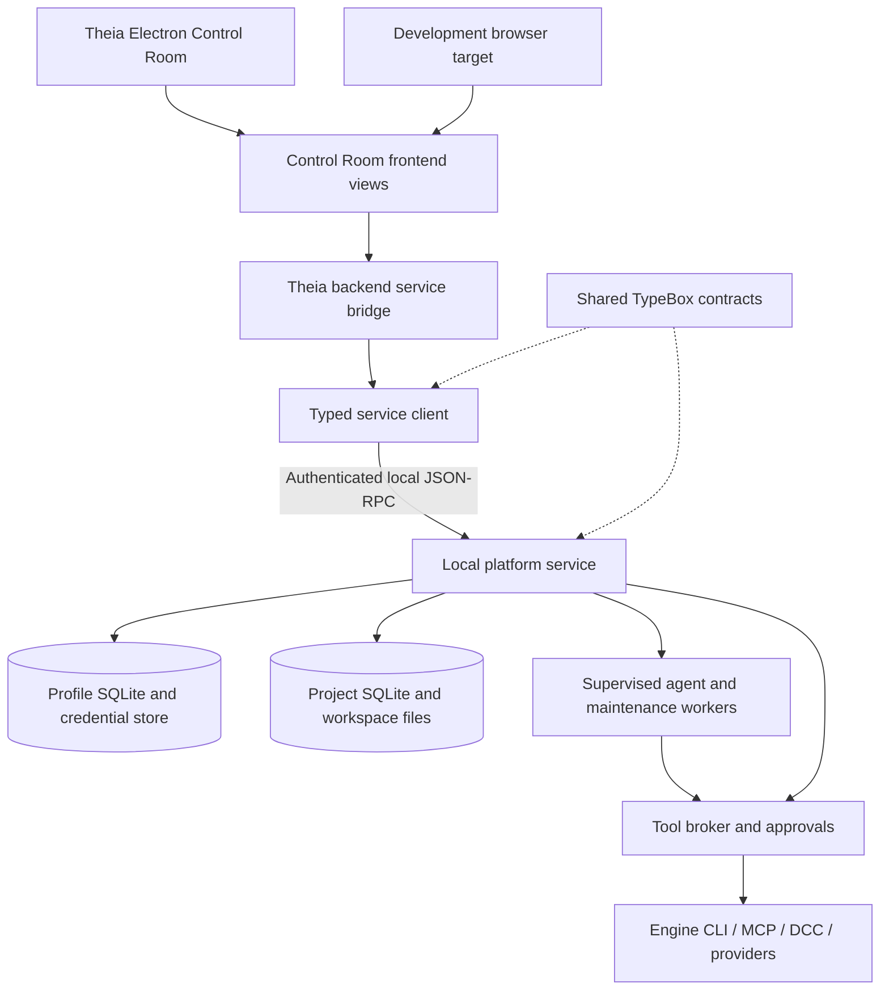

# PlayWeld system architecture guide

**Last updated:** 2026-10-02

**Scope:** Current component responsibilities and code paths. The [technical architecture](TECHNICAL_ARCHITECTURE.md) describes the complete selected target; [status](STATUS.md) identifies outstanding implementation. [Documentation index](README.md).

## Component map

The browser target shares application views but is a development/test entrypoint. It is not the desktop distribution target. Remote model and asset calls are integrations made by the local service; running PlayWeld locally does not make every configured provider local.

## Package responsibilities

| Package                             | Owns                                                                         | Main source entry                                                                              |
| ----------------------------------- | ---------------------------------------------------------------------------- | ---------------------------------------------------------------------------------------------- |
| `@gamecrafter/contracts`            | Runtime schemas, derived types, RPC table, notifications, errors             | [contracts/src/index.ts](../packages/contracts/src/index.ts)                                   |
| `@gamecrafter/platform-service`     | Persistent state, scheduling, authorization, connectors, domain services     | [service.ts](../packages/platform-service/src/service.ts)                                      |
| `@gamecrafter/service-client`       | Authentication handshake, typed calls, event subscription, transport cleanup | [service-client/src/index.ts](../packages/service-client/src/index.ts)                         |
| `@gamecrafter/theia-control-room`   | Frontend views and Theia backend bridge                                      | [control-room-protocol.ts](../packages/theia-control-room/src/common/control-room-protocol.ts) |
| `@gamecrafter/plugin-sdk`           | Language-neutral worker protocol through a TypeScript helper                 | [plugin-sdk/src/index.ts](../packages/plugin-sdk/src/index.ts)                                 |
| `@gamecrafter/plugin-sample-hello`  | Example plugin manifest, worker, tools and panel                             | [sample-hello](../packages/plugins/sample-hello/)                                              |
| `@gamecrafter/archive-extractor`    | Maintained archive extraction adapter used by the application                | [archive-extractor](../packages/archive-extractor/)                                            |
| `@gamecrafter/control-room`         | Electron product application and packaging                                   | [control-room/package.json](../apps/control-room/package.json)                                 |
| `@gamecrafter/control-room-browser` | Development browser application                                              | [control-room-browser/package.json](../apps/control-room-browser/package.json)                 |

Durable task, Project, board, learning and integration records belong in the service. Theia views and plugins must not become a second authoritative persistence layer.

## Persistence and identity

The global profile stores Project registration, platform settings, accounts and other cross-Project operational data. Each Project has its own manifest and `.gamecrafter/project.sqlite`. Design and canon files live in the Project's `docs/`; native engine content lives in `game/`.

SQLite access goes through [database.ts](../packages/platform-service/src/db/database.ts), the repository's `node:sqlite` seam. Schema migrations use the database migration layer. A service making a consistent backup uses database snapshots rather than treating an open SQLite main file as a complete database without its write-ahead state.

Project identity comes from `gamecrafter.project.json`, with schema version, UUID, engine family and creation metadata. Registration is profile-specific. Clone and restore reconcile duplicate identity and copied operational records. Engine family is immutable for a Project. An independent copied game needs its own identity rather than silently sharing running tasks and locks with its source.

Generated cache, logs, engine runs, worktrees, agent memory and SQLite operational files are excluded by the generated Project ignore rules. Review those rules before publishing a game repository; they do not automatically know every engine-specific generated directory.

## Local transport and client lifecycle

The service uses authenticated JSON-RPC on a Unix domain socket or Windows named pipe. Profile path resolution determines the socket/pipe identity and credential files. Clients call `session/hello` with the profile token, client identity and protocol version before other requests.

This transport is not an HTTP REST endpoint. The client uses `vscode-jsonrpc` stream readers/writers and handles connection close. The Theia bridge forwards requests and translates service notifications for frontend widgets. Notification-handler failures are contained so one client callback cannot crash delivery to other listeners.

Persisted records are the recovery source. A notification stream informs clients that something changed; a reconnecting view fetches state again. It must not infer durable task completion solely from having seen an event before losing a connection.

The complete API is generated in the [RPC reference](API_REFERENCE.md), including machine-readable parameter and result schemas. `schemaVersion` fields apply exactly where defined by contracts; callers must not invent extra properties in closed schemas.

## Settings, credentials and access control

Settings definitions carry value schemas, defaults and permitted scopes. Resolution chooses the most specific permitted override. Imports validate known definitions and can dry-run. Exports redact sensitive-looking values.

Provider secrets are encrypted with AES-256-GCM in the profile credential store. The encryption key is a local profile file, `credentials.key`. This reduces casual plaintext exposure in the database; it is not an OS keychain guarantee or protection from an attacker able to read both the profile and key. File permissions and operating-system account protection remain relevant.

The tool broker composes access ceilings from settings, session/context, request and task assignment. Full permits operations within other tool constraints. Restricted permits configured categories or tool-ID allowlists. Ask always allows read-only calls and requests approval for side effects. Tool minimum-mode requirements can deny an otherwise promptable operation.

Calls persist their decision, effective access mode, status, sanitized input/output, errors, evidence, cost and timestamps. Approvals are persisted and broadcast. Restart recovery fails interrupted tool calls explicitly rather than turning a pending call into success.

## Task execution and recovery

Tasks are persisted with parent/dependency relationships, goal, budget, assignee, state, lease, events, checkpoint and completion information. A supervisor starts workers and reconciles interrupted leases. Workers communicate through the registered worker protocol and handlers.

The task state contract is defined in [tasks/schema.ts](../packages/contracts/src/tasks/schema.ts). Its allowed transitions are explicit: ready work can be claimed, claimed work can run, running work can wait for input or terminate, and a failed task can be made ready for retry. Terminal state does not erase its event history.

An agent's context combines role instructions, active skills, available tools, Project records and model routing. Tool calls go through the broker. Budgets and access ceilings belong in the execution context, not only in prose inside a model prompt.

Process runners enforce timeouts and terminate owned descendants, including Windows subprocess trees. Cancellation and shutdown must release or reconcile leases, approvals and external process ownership. The tests cover specified paths, but no claim is made that every third-party editor shuts down cleanly; external bridge defects are recorded in acceptance notes.

## Change graph and integration

The change subsystem models nodes, edges, touches and impacts, weighted by confidence. Swarm requests create role-aware work, resource locks and Git worktrees. Completion contracts distinguish a task's execution evidence from acceptance into the main Project.

Integration records track validation, conflicts and reconciliation. Feedback can propagate through declared dependencies and impacted work. The system is tested with scripted models and real Git worktrees; live model-driven production change acceptance remains outside the current evidence.

Locks coordinate named resources. A Git worktree isolates a checkout's files; it does not isolate an already running editor, a shared model account, network service or remote paid-generation job. Connector identity checks and tool policy handle those separate boundaries.

## Models and providers

The model subsystem stores separate provider accounts, model metadata, pool policies, route decisions, usage and outcomes. First-party adapters cover OpenAI, Gemini Developer API, OpenRouter, xAI, Mistral, DeepSeek, Groq, and Azure OpenAI; Anthropic and generic OpenAI-compatible endpoints remain available. API keys and custom headers are stored in the encrypted credential store; OAuth/device login and cloud-native IAM are outside the selected contract. A sourced, versioned catalog enriches incomplete model-list responses with exact-ID facts. Every field records source, timestamp and confidence; unknown values remain distinct from unsupported values and from manual overrides. Published prices are estimates, not invoices.

Completion routing requires `chat: true`; an unknown/unsupported capability cannot satisfy a required feature. Provider-declared vision remains visible but cannot be selected for image input until the common chat request can carry media. Embeddings use the dedicated embedding operation rather than chat routing. Azure callable deployment names (`providerModelId`) remain separate from their documented base-model catalog IDs (`catalogModelId`). Role/work-type lists are hard allowlist restrictions; exact source categories that do not match the local taxonomy remain descriptive tags, and those restrictions stay empty/unrestricted.

Chat persists Project conversations and streams deltas. Agent mode delegates into Swarm. The native Theia AI model adapter and a chat-local tool execution loop remain unimplemented. Fixture provider tests establish contract/error behavior; they do not establish current remote account availability or provider quality.

## Connections, engines and DCC

MCP connection management supports command/stdio, endpoint transports and Docker launch modes, with revision negotiation, connection state, tool discovery and schema validation. Registered external tools enter the same broker used by builtin tools.

Engine connectors expose three layers: project files, headless process and live editor. Capability reports separate readiness, unavailable functionality and unverified paths. A live editor requires identity evidence matching the current Project or exact native game folder. Windows path comparisons account for case. A nearby or nested unrelated folder is not proof of identity.

Engine runs persist command, logs, result status and report artifacts. Test-report parsing distinguishes actual engine test failures from a process that merely exits zero. A screenshot operation requires a collectable PNG; file-backed images must resolve inside the intended Project boundary and pass type/size checks.

DCC uses installations, capability reports and recorded operation runs. Blender has live evidence; other connectors retain narrower fixture evidence. Actual version/host boundaries are in the [integration guide](INTEGRATION_GUIDE.md).

## Agent-to-agent protocol boundary

The A2A v1.0 integration is separate from MCP and from the authenticated named-pipe/Unix-socket control API. Outbound agent records retain endpoint, discovered Agent Card, static auth kind, and encrypted credential reference. JSON-RPC over HTTP(S) and streaming are supported; remote endpoints require HTTPS, loopback HTTP requires explicit configuration, and redirects/cross-origin interfaces cannot receive credentials. Remote delegation runs as brokered operations inside a local task and preserves Project access mode, approvals, and audit identity.

Inbound A2A is an opt-in, separate HTTP listener bound only to IPv4 loopback. Per-client bearer tokens are returned once and stored hashed; each grant scopes Projects, roles, `agent.run` kind, and operations. Task create/get/continue/stream/cancel runs through the durable TaskService. Continuation cannot approve broker requests; every task execution remains under an Ask-always ceiling. Strict Host/Origin checks, no permissive CORS, request and per-client limits, and active stream invalidation on credential/grant changes apply. Public/LAN exposure, OAuth/OIDC, gRPC, webhooks, task listing, non-text inbound parts, and direct administrative/tool RPC are unsupported.

## Knowledge, board and assets

The knowledge layer parses canon records, chunks text, indexes FTS5, optionally stores embeddings through Qdrant and retrieves citations. Authoritative documents remain files; indexes are derived records. Live Qdrant evidence is separate from fake embedding-provider coverage.

The board stores threads, messages, decisions and maintenance results. Maintenance agents use the same scheduling/model/tool infrastructure as other work. Supported decision synchronization does not imply arbitrary narrative canon reconciliation.

Asset services store provider accounts, job requests/status, retrieved files, provenance and previews. Generation transport is provider-specific. The viewer displays imported artifacts; it does not certify production topology, collision, license rights or deformation quality.

## Extensions and isolation

Agent Skills package instructions and supporting references. Roles package responsibility and tool policy. Plugins supply executable workers, tools and declarative contributions through a manifest and host protocol. These are different extension mechanisms and must not be conflated.

Linux plugin isolation has adversarial Bubblewrap test evidence on capable hosts. Hosted CI can skip tests requiring unavailable namespaces. Windows AppContainer behavior remains unverified and fails closed when the supported isolation path is unavailable. Plugin signature verification, more restrictive network filtering and other hardening remain listed in the decision register.

## Backup and distribution

Backup captures profile or Project snapshots, records manifests and verification, supports configured destinations, and restores into an empty destination. Registered Project restore reconciles identity; profile restore becomes active only after the service is launched with that profile directory.

Update handling checks compatibility, checksum and configured signature material. A missing trusted public key produces an unavailable signature-verification state; it is not a verified signature. Installer handoff, previous-installer capture, signing-key provisioning and tagged release/rollback acceptance remain open.

The architecture's complete target must be read with [current status](STATUS.md), [development plan](DEVELOPMENT_PLAN.md) and acceptance records. Neither a diagram nor an available RPC name proves broad live support.
