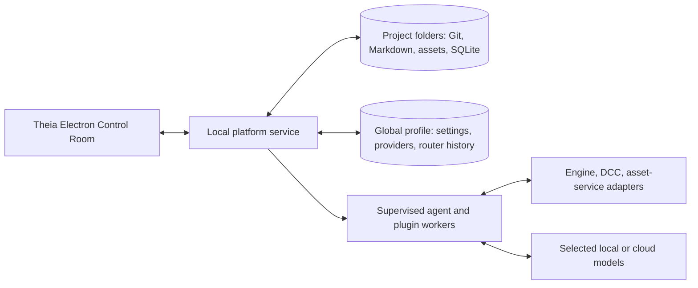

# Technical Architecture: Proposed Stack

**Status:** Complete target-stack recommendation. User-confirmed choices appear in `PLATFORM_DESIGN.md`; other selections here are engineering defaults authorized for best-practice judgment. Which parts exist as tested code is tracked in [DEVELOPMENT_PLAN.md](DEVELOPMENT_PLAN.md); this document is not an implementation claim.  
**Last updated:** 2026-10-04

This describes the complete target system. It is organized by component, not by milestone or release phase.

**Supported desktop systems:** Windows and Linux. Connector availability must be reported per OS. macOS is outside the intended support scope.

**Model hosting:** Connect to cloud providers or separately running local model servers. The desktop installation does not include a model inference runtime.

**Plugin execution:** Executable platform plugins run in separate processes with Windows/Linux operating-system isolation and a central tool broker. Docker or Podman is not required. The specific isolation implementation for each OS remains to be selected and verified.

**MCP server setup:** The platform can launch a local command, connect to an existing endpoint, or launch a configured local Docker container and connect to its MCP transport. Docker is optional and is not used as a required plugin runtime.

**Agent orchestration:** The local platform service runs a durable scheduler using Project-local SQLite. Supervised worker processes execute agents and tools; no separate workflow server is required.

## Public identity and compatibility

The public name is **PlayWeld**, with `playweld.com` selected by the user. Retaining existing application, package, storage, plugin, and release-feed identifiers is the engineering default for compatibility; see [the identity contract](BRANDING.md). A future identifier migration requires its own design and validation. The [brand asset family](../assets/brand/README.md) supplies the canonical UI mark, favicon, and package icons; website code remains outside this repository rebrand.

## Recommended core stack

| Component | Recommendation | Reason |
| --- | --- | --- |
| Desktop Control Room | Eclipse Theia on Electron; TypeScript and React for custom views | Builds on the selected Theia workbench, editor, terminal, debugging, Git, and extension support. Theia already divides its frontend and Node backend. |
| Platform service | Separate local Node.js/TypeScript process, with a versioned local RPC/event API | Owns durable work independently of the desktop window, including Projects, agents, routing, plugin hosts, settings, backups, and indexes. Supports the chosen window-close setting. No hosted service is required. |
| Agents and tasks | Local service scheduler with a transactional task/event graph in Project SQLite, run by supervised worker processes | Preserves parent/child tasks, board messages, decisions, leases, checkpoints, retries, costs, and validation evidence across crashes or restarts. No separate workflow server is required; concurrency and budgets are settings. |
| Project data | Markdown and game/source/asset files in each Project folder; Project-local SQLite for operational state | Keeps canon portable and reviewable while making discussion, task, and asset metadata queryable. A full folder clone carries its Project state. |
| Global profile | Separate SQLite database plus encrypted credential store | Holds providers/accounts, installed plugins, global settings, and shared router learning outside Project clones. |
| Search | File/code search plus SQLite FTS5 for indexed text; read/write adapters for connected local vector databases such as Qdrant | Source files stay authoritative. The platform writes embeddings and queries them for semantic retrieval; indexes are derived and rebuildable. |
| Asset inspection | Three.js view with glTF/GLB preview derivatives; 2D image viewer | Supports orbit, animation, scene hierarchy, materials, and LOD inspection. Original DCC files remain the source assets. |
| Contracts | TypeScript interfaces with versioned JSON schemas for persisted records and plugin/RPC messages | Gives plugins and connectors a stable, language-neutral boundary. |
| Skills and agent roles | Agent Skills (`SKILL.md`) directories with `gamecrafter-*` metadata; Markdown+frontmatter role packages | Interoperates with the existing skill ecosystem (agentskills.io, skills.sh) and familiar subagent-definition conventions; see [SKILLS_AGENTS_AND_TOOLS.md](SKILLS_AGENTS_AND_TOOLS.md). |

Theia's frontend/backend split and local Electron operation are documented in its [architecture overview](https://theia-ide.org/docs/architecture/). [Theia AI](https://theia-ide.org/docs/theia_ai/) can supply reusable chat, agent, tool, and model UI pieces where they fit, but the platform service should own the persistent recursive swarm, access enforcement, and adaptive model router. Its interfaces should not make our Project and task records depend on Theia internals. Theia AI's documented extension points (agents, prompt fragments, capabilities, tool providers, `AiConfigurationCategory`) fit the in-editor chat and configuration surfaces; its LLM-provider layer is documented as not yet having a fixed contribution point, which is a further reason to keep the model router in the platform service ([Theia AI](https://theia-ide.org/docs/theia_ai/)).

## Process and data boundaries

- The desktop uses a local, authenticated API. Plugins and engine bridges do not receive unrestricted access to that API by default.
- The service records a work request as durable tasks and events. Workers claim tasks, publish findings to the Project board, create child tasks, and checkpoint results. Each side effect is linked to the responsible task, files, tool call, and validation record.
- Confirmed coordination rule: use isolated Git worktrees for independent code/docs work and resource locks for shared live engine or asset operations. A task cannot claim a mutable engine session or asset source already held by another incompatible task. The coordinator validates and resolves conflicts before integration.
- A new Project folder contains its game repository, readable records, Project configuration, Project SQLite database, and local task history. Secrets and shared routing observations stay in the global profile. A clone gets a new Project ID and should reset Git remotes by default. Selected layout (manifest v1): `gamecrafter.project.json` at the root; `docs/` for canon and design records; `game/` for engine files; `.gamecrafter/` for `project.sqlite`, `logs/`, and `cache/` (the database and both directories are excluded from the Project's Git repository; the folder as a whole is what backups and clones copy); `.agents/skills/` for Project-authored skills; a generated `AGENTS.md`.

## Agent, model, and access design

- Model providers implement one common request/stream/tool-use interface. Provider accounts are separate records, so the same provider can have multiple accounts. A model registry captures capabilities, price, limits, and freshness of metadata.
- Local-model connectors point to an independently running endpoint on the user's machine or network. The platform does not install or supervise model-serving engines. Cloud and local endpoints use the same eligibility and routing pipeline, while retaining endpoint-specific capabilities and privacy settings.
- The router first enforces account, agent, task, capability, and user-pool eligibility. It then estimates quality, cost, latency, and reliability from provider data and local outcomes. A small manager model can help classify and rank work but cannot override eligibility. The service records candidate sets, selections, validation, user feedback, and cost for ongoing policy learning.
- The agent runtime uses a compact registry of eligible tools and skills. It loads full instructions/schemas only when chosen and can discover more during a task. Spawned agents inherit the parent's maximum access and receive their own task, context, model, budget, and worker identity.
- A single tool broker applies Full access, Restricted, or Ask always at execution time and logs the decision. Full access permits high-risk actions as requested. Restricted and Ask always require strong boundaries for executable plugins; a plugin running with ordinary host filesystem or network access could bypass a prompt. Game-platform plugins therefore run in supervised, isolated workers with declared capabilities and brokered operations. No Docker or Podman dependency is required. The exact OS isolation mechanism must be chosen and verified for Windows and Linux.
- Theia/VS Code-compatible extensions are a separate runtime with their own privileges. The catalog must show that distinction; our access mode cannot honestly promise to govern arbitrary third-party editor extensions unless their execution is isolated under the same policy.

## Plugin and connector contract

The unified Plugins catalog shows both coding extensions and platform plugins. Native game-platform plugins use a versioned manifest declaring entry points, contributed module/genre/agent/skill/tool/UI types, compatible versions, settings schema, dependencies, requested capabilities, and migrations. Runtime plugin code runs out of the main UI process. UI additions use registered extension points or declarative panels so community packages do not need to rebuild Theia. Theia's [extension model](https://theia-ide.org/docs/extensions/) distinguishes compiled Theia extensions from installable compatible extensions; the platform plugin API is our own contract.

Engine and DCC connectors implement capability discovery, connection status, read/inspect, apply, and validate operations. Unity, Unreal, and Godot connectors use CLI and/or MCP. Other authoring and generation services use their actual supported MCP, CLI, or API surface. Adapters expose engine-specific actions without pretending Unity, Unreal, and Godot have identical capabilities. Meshy, Tripo3D, and similar services use the same asset job lifecycle: request, status, result, license/provenance, review, import, and validation. The source asset remains intact; preview conversion creates derived glTF/GLB where needed. [Three.js GLTFLoader](https://threejs.org/docs/pages/GLTFLoader.html) supports the preview format.

**Chosen engine boundary:** use CLI and MCP connectors. Each connector reports its actual engine process or MCP session, Project identity when available, engine version, readiness, supported operations, and validation evidence. The platform must distinguish file/CLI access from a verified live editor connection and must not claim editor actions that its connector cannot perform. In-editor companion plugins may be considered as a later expansion of the connector system, but are not required by the current design.

Engine test acceptance uses structured completion evidence in addition to process status: Unity NUnit XML and Unreal Automation JSON must contain successful, completed non-empty tests with consistent counts. The [live Windows acceptance record](LIVE_ENGINE_ACCEPTANCE.md) covers selected Unity 6000.6.0f1 and Unreal 5.8.3 fixtures, approvals, packaging and built-player assertions. CLI tool versions and editor versions remain distinct; [Extended acceptance](EXTENDED_ENGINE_ACCEPTANCE.md) adds official Unity live identity and screenshot collection, Windows/Linux/WebGL rendering/audio, browser input, Unreal editor bridge calls and adapted brokered screenshots, and Linux commandlet startup. File-backed screenshots are collected only within the current Project; screenshots without an image artifact fail. Other versions/targets, production Projects and remaining bridge bindings stay Verify.

**MCP connection manager:** store each server's launch or endpoint definition in organized settings, with platform/Project scope and effective configuration shown. For a Docker-launched server, configure image reference, command, transport, mounts, environment/secrets, startup/stop behavior, and connection health. The platform starts and supervises only containers it launched; it can also connect to a user-managed server endpoint. The tool broker applies agent access rules to MCP calls, while container mounts and network privileges are shown as part of that server's capabilities. Support MCP transport/version negotiation across revisions 2025-03-26 through 2026-07-28 instead of hard-coding one; the 2026-07-28 revision removes protocol sessions and the initialize handshake, adds `server/discover`, and deprecates Roots, Sampling, and Logging, while many community engine/DCC servers still implement the older handshake ([MCP changelog](https://modelcontextprotocol.io/specification/latest/changelog)). Docker's [run command](https://docs.docker.com/reference/cli/docker/container/run) supports container input/output, mounts, and environment configuration; the MCP [TypeScript SDK](https://ts.sdk.modelcontextprotocol.io/) supports standard stdio and Streamable HTTP transports.

## Storage, backup, and recovery

Canon and design remain Markdown in Git. Agents write new durable knowledge to those reviewable files or structured Project records; they do not create vector-only canon. Project SQLite stores structured operational data, references, task/board history, and indexes. SQLite [FTS5](https://www.sqlite.org/fts5.html) indexes text. Vector storage is selectable: embedded LanceDB, lightweight SQLite exact cosine search, PlayWeld-managed native Qdrant, an existing local Qdrant service, or a remote Qdrant endpoint. Backend and deployment are distinct settings. Each adapter must enforce a Project namespace, idempotent upsert, deletion, dimension/version checks, and backend-neutral filtered retrieval. The indexing service records destination identity with vector mappings and re-embeds unchanged sources when the destination changes. Old destinations are retained rather than deleted during a backend switch. Markdown and source files remain authoritative and indexes are rebuildable. See [vector storage research](research/vector-storage-options.md).

Embedded indexes live under `.gamecrafter/vectors.lancedb/` or `.gamecrafter/vectors.sqlite`; managed Qdrant stores data under `.gamecrafter/qdrant/`. A single platform service owns local handles and managed processes, closing them during shutdown. Cached handles for previous settings remain owned until service shutdown, avoiding closing a database during an in-flight read. Database directories must not be copied as a consistent live backup without quiescing or a backend snapshot; rebuilding derived indexes after clone/restore remains the conservative path. No vector-only authored knowledge is permitted.

Explicit remote mode requires HTTPS and `knowledge.vectorStore.allowRemote`; it sends embeddings and source metadata, not source chunk text in Qdrant payloads. Legacy `qdrant` configurations without deployment retain external-endpoint behavior, including their prior transport policy; users should migrate remote URLs to explicit remote mode. Credentials remain profile-encrypted references. Managed Qdrant uses a private API key, loopback REST, no unused gRPC/CORS/cluster/telemetry, a pinned binary prepared at package-build time, and version-checked readiness. The local control API remains OS-native IPC, not the Qdrant HTTP endpoint.

Additional backends can register trusted service adapters through `PlatformServiceOptions.knowledgeVectorStoreAdapters`. Registration rejects duplicate IDs and unsupported deployments. This is not a marketplace-plugin runtime contribution: executing third-party adapter code through the isolated plugin protocol and publishing adapter capability discovery remain open.

Built-in adapters check mapped point presence during reconciliation, so missing vector data is regenerated without requiring source edits. Failed deletions retain mappings for a subsequent reconciliation retry. Derived vector directories are excluded from Project Git and clone copies; cloned Projects rebuild their own indexes. Configuration saves use the existing atomic settings-import transaction, and settings changes during an index task cause another pass. Legacy external endpoints still require HTTPS whenever a credential would otherwise traverse non-loopback HTTP. Registered non-HTTP adapters must supply their own connection validation while explicit remote consent remains enforced by the registry.

Backup jobs snapshot either whole Project folders or the separate global profile, with destination plugins for local, FTP, S3, Google Drive, and others. Both scopes are encrypted by default with a user-controlled recovery secret stored separately from backup archives. A backup manifest records content hashes, schema/plugin versions, and restore requirements. Restore goes to a new location first for verification and can then be selected as the active Project/profile. Recommended settings include manual and scheduled runs, retention rules, compression, integrity checks, and optional incremental archives. Use a maintained authenticated-encryption library and password-based key derivation; do not invent a new archive cipher or store the recovery secret with the archive.

## Engineering defaults for remaining technology choices

- **Repository layout:** one TypeScript monorepo (this repository) holds the design documents, the Theia app (`apps/control-room`, plus a development-only browser target), the platform service, shared contracts, the service client, and later the plugin SDK and first-party connectors under `packages/`. Keep Project files independent of the platform source repository. Publish versioned plugin contracts and migration rules.
- **Toolchain (selected 2026-09-28):** Node 24 (Theia 1.75 requires `>=24`; Electron 42 bundles Node 24), npm workspaces (Theia itself moved from yarn to npm) with Turborepo for task orchestration, TypeScript 5.9 with strict CommonJS output, Vitest for tests, ESLint + Prettier. Theia packages are pinned to one exact version (`1.75.0`, Electron `42.10.0`, React 19 as Theia's peer dependency). Dependencies are pinned exactly and preferred when published at least seven days earlier.
- **SQLite:** `node:sqlite` (`DatabaseSync`; SQLite 3.53 with FTS5 and JSON1 confirmed present) behind one small `Database` seam in the platform service so a native module such as `better-sqlite3` can replace it if the module's release-candidate status becomes a problem. No native SQLite dependency is bundled.
- **Contracts:** TypeBox schemas with derived TypeScript types, validated with Ajv. Every persisted record and RPC message carries a `schemaVersion`; IDs are UUIDv7 so they sort by time in SQLite.
- **Local API:** JSON-RPC 2.0 (`vscode-jsonrpc`) over a local-only, OS-native IPC endpoint: a Unix domain socket under `$XDG_RUNTIME_DIR/gamecrafter/` (fallback under the profile directory) on Linux and a per-profile named pipe on Windows. A per-install random token stored with owner-only permissions in the profile directory must be presented in the first request (`session/hello`, which also negotiates the protocol version) or the connection is closed. Workers and plugins reach Projects and tools through service-issued capabilities. The control API is never bound to a TCP interface.
- **Theia integration boundary:** the Theia backend hosts one bridge that discovers the running service (or starts it) through the service client and exposes a frontend-facing proxy; Theia frontend code never touches sockets, files, or SQLite. Git, merge-conflict handling, themes, and language basics come from the VS Code builtin plugins downloaded at build time (`@theia/git` is no longer published); the Project Home view is the landing surface instead of Theia's Welcome page.
- **Plugin languages:** publish a TypeScript SDK over a language-neutral process protocol. Permit Python and native executable workers through the same protocol, so DCC-specific integrations do not require a Node rewrite. Use registered UI extension points rather than allowing marketplace plugins to alter Theia internals directly.
- **Skills and roles:** ship a curated 30-skill first-party game-development library as platform-service build assets, enabled by default with per-Project controls; use bounded `skills/read-resource` RPC/broker reads and the Control Room reference reader for progressive disclosure; see [library guide](GAME_DEVELOPMENT_SKILLS.md). Adopt the Agent Skills open format for installable skills and a Markdown-plus-frontmatter role package; use three-tier progressive disclosure through a broker `activate_skill` tool; accept every source form the `skills` CLI accepts; details in [SKILLS_AGENTS_AND_TOOLS.md](SKILLS_AGENTS_AND_TOOLS.md).
- **Settings:** typed schemas with validation, migrations, and platform → Project → applicable session precedence. Each page shows the effective value and source. Plugin settings use the same schema and navigation system.
- **Knowledge records:** give canon and design entries stable IDs and typed metadata in Markdown. The Project database stores links, task/board state, and index checkpoints; source files remain readable and reviewable. Use schema migrations that preserve older Project content.
- **Semantic search:** offer LanceDB and SQLite embedded storage plus managed-local, existing-local, and remote Qdrant through a backend-neutral adapter interface. Preserve lexical-only defaults and existing Qdrant settings; selecting storage does not configure an embedding model. Additional local/remote backends register at the trusted service extension boundary. Embedding models are selected from the same local/cloud registry and pinned per index version. Changing the model or destination requires a rebuild. Project identity must be enforced on every vector write and query.
- **Model routing:** eligibility filters are deterministic; a quality-first contextual selection policy learns from engine validation, tests, reviewer findings, user feedback, cost, and latency. Explore only eligible models within configured budgets. Keep outcome history and policy versions so bad updates can be inspected and rolled back.
- **Model capacity:** follow the selected model's reported context/input and output limits; see [capacity and budgets](#model-capacity-and-task-budgets).
- **Git integration:** auto-integrate validated, conflict-free work only when the selected access mode permits it. Conflicts are assigned for reconciliation and revalidation; never force an unseen overwrite. Shared live engine/DCC sessions use leases with expiry and explicit ownership.
- **Recovery:** on service restart, reconcile tasks and external side effects before retrying. Workers use idempotency keys and checkpoints; uncertain non-idempotent actions stop for review. Window-close and restart behavior follow Settings.
- **Security:** Full access remains unrestricted as requested. Restricted and Ask always fail closed for a plugin or connector when its OS isolation or requested capability cannot be enforced. Selected candidate mechanisms are AppContainer plus Job Objects on Windows and a bubblewrap launcher layered with Landlock and seccomp on Linux ([research](research/process-isolation.md)); verify them against real plugin escape tests before describing them as enforced.
- **Validation:** contract tests for plugins/connectors, Project clone/restore and migration tests, agent recovery tests, and live engine/DCC tests only against a verified connected instance. Record exact command/tool results as evidence; a running process alone is not a live editor test.

These are selected engineering defaults under the user's direction to move quickly. The exact Windows/Linux sandbox mechanisms, archive format, and database schemas require implementation research and testing, but they do not require another routine preference question.

## Model capacity and task budgets

These are selected engineering defaults implementing the [user-confirmed capacity requirement](PLATFORM_DESIGN.md#model-capacity-and-user-budgets). Select one eligible model before each agent turn and retain that selection for compaction and completion. Read provider/manual registry metadata; never infer capacity from a model name. For a shared context window, reserve the requested output allowance; apply a separately reported input limit independently. Include message content and tool schemas in the same character-based token estimate for both compaction and final checks. This estimate is not a provider tokenizer; the provider remains authoritative.

Use the reported output maximum automatically. Unknown OpenAI-compatible capacity stays provider-managed, with no invented output limit or context ceiling. Anthropic requires an explicit output allowance: when neither the request nor registry supplies it, fail with refresh/manual-metadata guidance rather than guessing. Provider discovery reads OpenRouter's `context_length` and `top_provider.max_completion_tokens`, and Anthropic's `max_input_tokens` and `max_tokens`. Preserve existing capacities when a subsequent ID-only discovery omits them, and preserve manual overrides.

The compatibility setting `coordination.maxTranscriptTokens` now defaults to zero (automatic); a positive value is an explicit lower input ceiling. New task snapshots use `contextTokenCeiling`; legacy fixed snapshot/checkpoint allowances do not override model capacity. Existing persisted user settings remain effective for newly created tasks. A cumulative task token budget measures repeated input plus output across calls and is separate from context capacity. Swarm supplies none by default; delegation inherits an explicit parent ceiling and ignores model-invented child token ceilings. Existing durable task budgets remain unchanged. Cost/time budgets and role turn limits remain separate operational controls.

Compaction preserves pinned instructions, keeps complete assistant/tool groups, and summarizes oversized history in model-sized fragments. Summaries can be compacted again on subsequent turns. Every summary call reports usage and observes explicit task budgets. A truncated response executes no partial tool calls and reports the actual output allowance. Model capacity and metadata source appear in Models, and each agent turn records its selected capacities in progress events. This source behavior is regression-tested; deployment and paid-provider acceptance are separate evidence.

## Review-selected copy and settings defaults

Engineering defaults, 2026-10-01: cloning takes a consistent SQLite snapshot and rebinds structured Project ownership to the new ID, including nested JSON records. Authored text, original-source provenance, completed history, settings, and Git history are retained. Derived knowledge/change/preview caches, resource locks, live bindings, and capability caches are cleared. In-flight tasks and generation observations are cancelled in the copy; outstanding approvals are rejected and pending integrations aborted. The source work continues independently. Source worktrees and their Git registrations are excluded. The same state rewrite applies when restore assigns a new ID because the original is already registered. These rules prevent copies from resuming external work or using the original Project's worktree. Machine-specific paths inside authored settings still need an explicit portability policy.

The Settings export is a versioned JSON snapshot of effective values, their source scopes, and contributing layers. Redaction applies the setting ID as a sensitive-field key to every exported layer as well as the effective value; nested credential fields and token-like values are redacted. Export does not modify settings or include the credential store. Project overrides travel with Project clone/backup, platform overrides with profile backup, and session overrides are ephemeral. Import previews a merge into the explicitly selected platform or Project scope, validates the entire batch before one transaction, preserves other overrides, and skips unknown or redacted values. Plugin-owned settings migrations remain open. The UI requests the snapshot from the service and downloads JSON; durable state remains in the service.

A configured update signing key is an authority requirement: both absent and invalid signatures reject the download. Without a configured trusted key, SHA-256 verification remains available and the signature is reported unavailable. Installation instructions respect saved schema compatibility. Trusted key distribution and the complete installer/rollback workflow remain open in WP19.

The 2026-10-01 review selects an exact Electron `42.10.0` root override over Theia's published `42.8.1` peer and a callable CommonJS archive adapter for patched `@xhmikosr/decompress` `11.1.4`. These repair dependency audit findings while retaining all Theia packages at `1.75.0`; builds and live UI evidence are recorded in [FULL_PROJECT_REVIEW.md](FULL_PROJECT_REVIEW.md).

## Control Room appearance and review surfaces

The user requested a modern gaming appearance, dark violet surfaces, and neon green accents. The selectable `PlayWeld Neon Green` theme applies these colors through Theia/Monaco semantic theme keys. It is the default for profiles without an explicit theme preference; explicit user, workspace, folder, and session choices remain respected. Shared widget styling follows semantic colors so alternate and high-contrast themes remain usable.

Settings import and Audit & History use the platform RPC bridge. Import state and audit filters are transient frontend state; imported overrides and audit records remain service-owned. Audit export is explicitly a page of events plus recent calls, not an export of every historical record. Retention/deletion policy and approval grouping remain open.

Knowledge search accepts an optional Project-local task ID and estimated `maxTokens` budget. The service obtains task goals and declared resources from its task store, boosts matching file/canon resources and goal terms after lexical/semantic fusion, and includes only complete quoted chunks that fit the estimate. Agent search supplies its own task identity and defaults to a 4,000-token estimate; this is not an exact provider-tokenizer guarantee.
