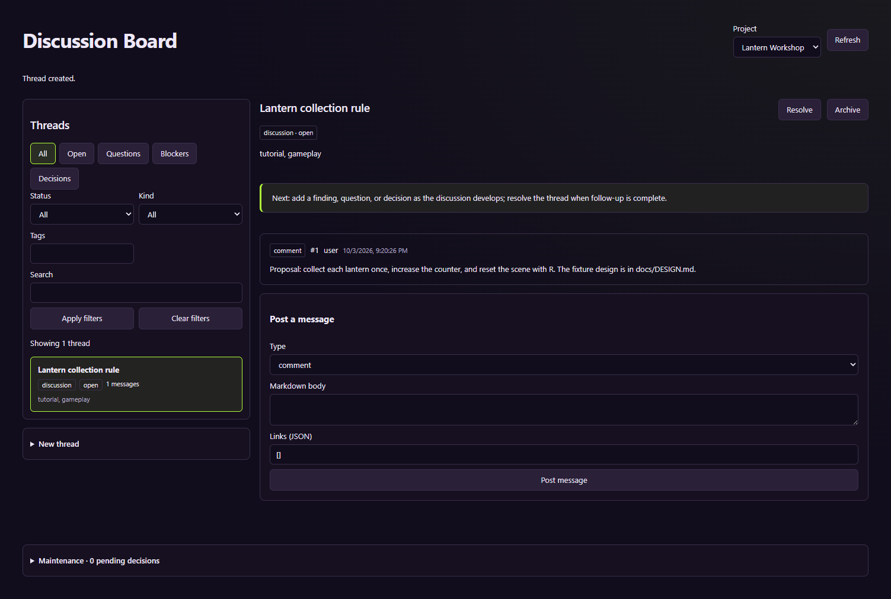
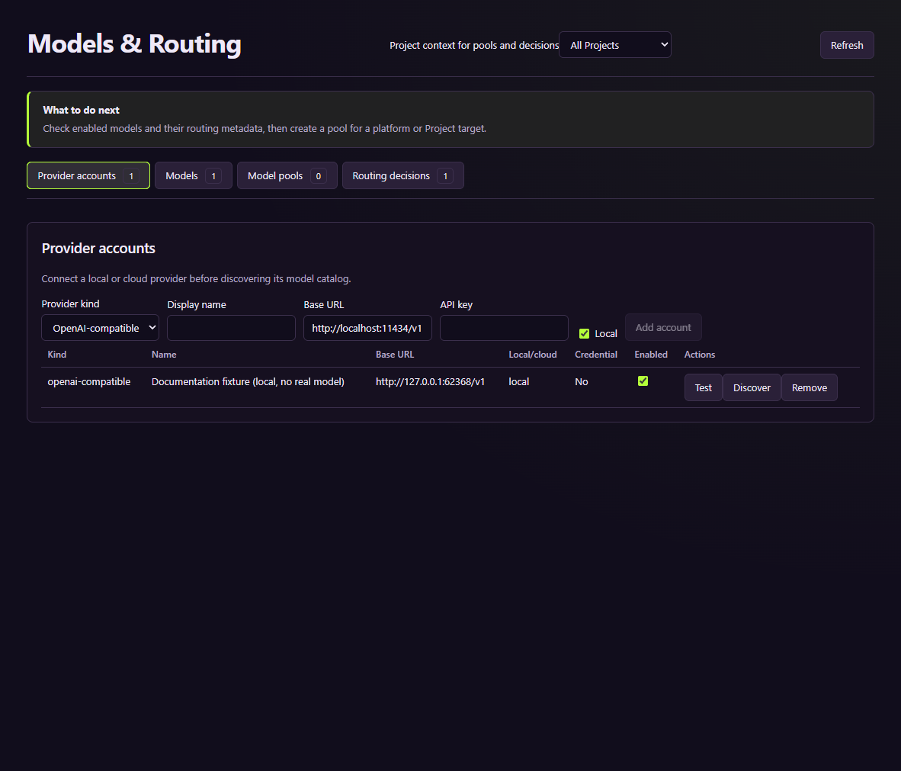
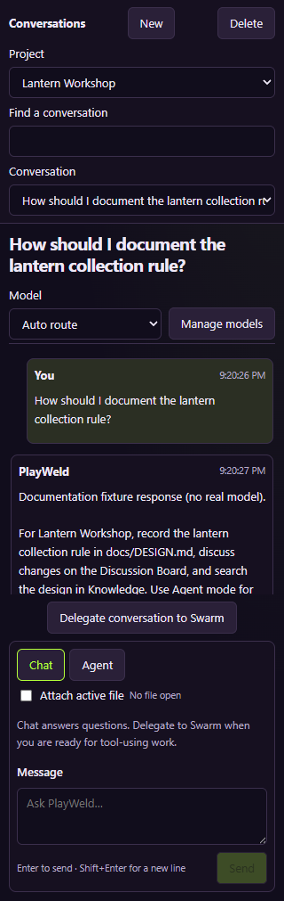
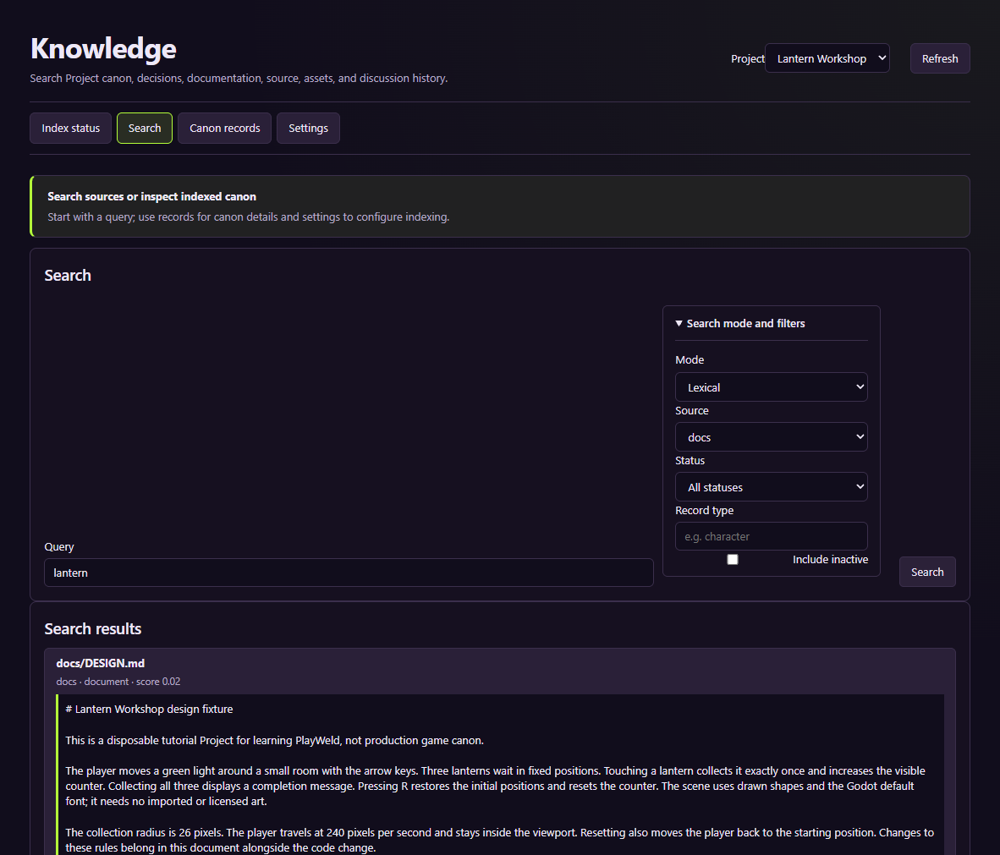

# Learn PlayWeld with Lantern Workshop

**Last updated:** 2026-10-04

This walkthrough uses a disposable Godot Project to explain how game files, design documents, discussions, model conversations, and operational records fit together. Start with the [user guide](USER_GUIDE.md) for installation, then follow this tutorial. Use the [Control Room handbook](CONTROL_ROOM_HANDBOOK.md) when you need a particular screen, and the [documentation coverage record](DOCUMENTATION_COVERAGE.md) to distinguish observed behavior from unverified operations.

The screenshots were captured 2026-10-04 from the built development browser Control Room connected to an isolated platform service on Windows; the report records version 0.6.0. Electron is the desktop product; these are browser UI captures, not installer or desktop acceptance. The example model is a local deterministic HTTP fixture and labels its response accordingly. It verifies the application's chat flow without asserting that a real model understood the game. Empty provider, engine, and backup screens illustrate configuration, not completed integrations. The [capture report](images/lantern-workshop/capture-report.json) records the current overview; the [dated workflow report](images/lantern-workflows-2026-10-04/capture-report.json) records the expanded scenarios.

## Start an isolated workspace

For manual practice from a built source checkout, open a PowerShell terminal at the repository root. Choose a new profile and a new Project parent directory:

```powershell
$env:GAMECRAFTER_PROFILE_DIR = 'E:\PlayWeldTutorial\profile'
$env:THEIA_CONFIG_DIR = 'E:\PlayWeldTutorial\theia'
npm run start -w @gamecrafter/control-room
```

The profile selects the service's database, authentication files, settings, account registry, and registered Projects. The Theia directory selects the application's separate layout/preferences. Set both before starting the application. Neither setting changes the profile of an already running process. You can use a different drive or directory; keep the two paths separate from your normal work.

Wait for **Connected to platform service** in Project Home. A window opening is not enough: if this message is unavailable, resolve the service connection before creating the Project. The [operations guide](OPERATIONS_GUIDE.md#service-lifecycle) gives status and foreground diagnostic commands.


Project Home is the entry point to the platform screens. Its cards group tools by purpose, while the top-level **PlayWeld** menu groups destinations under **Plan & Collaborate**, **Build & Connect**, **Configure & Extend**, and **Review & Maintain**. The Projects table lists registered games. Some tools have their own Project selector and their own section navigation. Always check the Project selector when switching between games.

## Create Lantern Workshop

Click **Create Project**. The wizard contains six steps:

| Step | Enter or select | What it means |
| --- | --- | --- |
| 1 | `Lantern Workshop` | Display name of this test game |
| 2 | `Disposable documentation and testing Project` | Description of its purpose |
| 3 | `Godot` | Engine family; creation locks this choice |
| 4 | `Adventure` | Genre metadata; comma-separated input supports multiple genres |
| 5 | `E:\PlayWeldTutorial\projects` | Parent directory; the service creates a child folder |
| 6 | The Create confirmation | Confirms the name, family, and destination |

Use Escape to cancel a step without finishing creation. Review the last step carefully; choosing the wrong engine family is not repaired by changing a selector later.


After creation, locate the Project in the table. Its **Open** button selects the native workspace. If Theia asks whether you trust the authors, inspect the folder shown and trust your own tutorial Project. Do not accept a different folder based only on its name.


Creation builds the PlayWeld workspace structure and Git repository. It does not install Godot or automatically make an empty `game/` directory a working native game. These are separate steps.

## Add the reusable test game and design

The checked-in fixture lives under [examples/lantern-workshop](examples/lantern-workshop/README.md). Copy its `docs/` and `game/` contents into the corresponding folders of your new Project. In PowerShell, replace the destination below with the actual path shown in Project Home:

```powershell
$tutorialProject = 'E:\PlayWeldTutorial\projects\lantern-workshop'
Copy-Item -Path 'docs\examples\lantern-workshop\docs\*' -Destination "$tutorialProject\docs" -Recurse
Copy-Item -Path 'docs\examples\lantern-workshop\game\*' -Destination "$tutorialProject\game" -Recurse
```

Use a newly created tutorial Project for this copy so you do not overwrite real game files. The fixture deliberately leaves `gamecrafter.project.json`, `AGENTS.md`, and `.gamecrafter/` to PlayWeld. Copying another Project's manifest would copy its identity as well.

The resulting layout includes:

```text
lantern-workshop/
  gamecrafter.project.json  PlayWeld identity and engine metadata
  AGENTS.md                Instructions for work on this game
  docs/
    DESIGN.md              The tutorial's movement and collection rules
  game/
    project.godot          Native Godot configuration
    main.tscn              Starting scene
    main.gd                Movement, collection, reset, and drawn visuals
  .gamecrafter/            Service-owned Project state
  .agents/skills/          Project-local skill instructions
```

Open `game/project.godot` in your installed Godot 4 editor to inspect the example. Its intended controls are arrow keys to move and R to reset. Three gold lanterns can be collected once each. The design lists explicit acceptance checks. Native execution evidence, if collected, belongs beside the engine version and test result; seeing these files in Control Room is a separate check.

## Record a discussion

Open **Discussion Board** from Project Home or **PlayWeld > Plan & Collaborate**. Select Lantern Workshop. Expand **New thread**, then enter:

| Field | Example |
| --- | --- |
| Title | `Lantern collection rule` |
| Kind | `discussion` |
| Tags | `tutorial, gameplay` |
| First message | `Proposal: collect each lantern once, increase the counter, and reset the scene with R. The fixture design is in docs/DESIGN.md.` |
| Message type | `comment` |

Click **Create thread**. The thread should appear in the list and its first message should appear in the detail area. If the screen displays an error, keep the error text and confirm whether the thread exists before retrying.



Use a discussion to explore changes. Use an evidence message for a real observation, including the command, version, and result. Use the binding-decision flow when adopting a decision; inspect the resulting document proposal before treating it as applied canon. A comment containing the word “decision” is not automatically an accepted document edit.

## Configure a model and ask a question

Open **Models** from Project Home or **PlayWeld > Configure & Extend > Models & Routing**. In ordinary use, add a provider account with its actual API base URL and credentials, discover the available models, then add selected models. Discovery preview and adding models are separate actions. Confirm the model is enabled and its capabilities match what you need. See the [models chapter](CONTROL_ROOM_HANDBOOK.md#models-and-routing) for details.



The automated screenshot capture starts a local fixture provider for this step. It is not a provider you should copy into your normal profile: its temporary endpoint disappears when the capture ends. For manual practice, use your own configured local or remote provider.

Open **Chat** from Project Home or **PlayWeld > Plan & Collaborate**, select Lantern Workshop, leave **Chat** mode selected, and send:

```text
How should I document the lantern collection rule?
```

Enter sends; Shift+Enter adds a newline. **Auto route** asks the router to select a suitable model. Selecting a specific model still requires that it be eligible for the request. **Attach active file** sends context from the selected editor file; leaving it unchecked does not make the entire Project an attachment.



Use **Find a conversation** to filter both the conversation list and selector. A conversation starter on a new chat fills the composer but does not send; review the draft, then press **Send** or Enter. The narrow [mobile-width capture](images/lantern-workshop/05-chat-mobile-starter.png) shows the compact stacked layout with the starter still unsent. The [search capture](images/lantern-workshop/05-chat-search.png) shows the filtered result. Neither image represents a mobile app or touch-device acceptance.

The response shown here is scripted. It demonstrates request routing and conversation persistence, not model reasoning. A normal provider response should be checked against the actual game files and design.

For implementation work, switch to **Agent** or use **Delegate conversation to Swarm**. A useful request is bounded and names the evidence needed:

```text
In game/main.gd, add a visible timer for collecting the three lanterns.
Start timing on the first movement, stop when the third lantern is collected,
and reset the timer with R. Update docs/DESIGN.md with the adopted behavior.
Keep the current arrow-key movement and collection radius.
Validate reset and completion in Godot and report the exact engine version,
changed files, and test result. Do not claim an engine check if none ran.
```

This example is an instruction template, not a task executed by the screenshot run. Review the budget, role, approvals, integration result, and tests in **Swarm** before accepting a resulting change.

## Find the design in Knowledge

Open **Knowledge** from Project Home or **PlayWeld > Plan & Collaborate > Knowledge & Canon**, select Lantern Workshop, choose **Index status**, and click **Reconcile** after adding the fixture documents. Reconcile queues work; wait for its completion and the index state to settle. A queued task ID alone is not proof the document has been indexed.

Choose the **Search** section, expand **Search mode and filters**, choose **Lexical** and source **docs**, enter `lantern`, and click **Search**. This mode searches indexed text without requiring an embedding provider. The results should include a citation for `docs/DESIGN.md`. Inspect the excerpt and source path before using it to support a claim.



**Semantic** search requires embeddings and vector storage. **Hybrid** combines retrieval paths and can report degraded behavior when one path is unavailable. The tutorial's lexical search does not verify those services.

## Check configuration and inspect other tools

Open **Settings** and search for `access.mode`. The screen shows the effective value and its source. Changing a Project override should affect that Project; changing a Platform override affects inheriting Projects. **Reset** removes the selected override so the inherited layer becomes effective again.

Use **Skills & Roles** to select a skill collection and read bundled instructions. In **Swarm**, expand **New request** before entering a change request; use **Approvals**, **Integrations**, and **Resource locks** for those related records. Use **Engine** to inspect native-file detection and separately configure an installation or live bridge. Use **Audit & History** to locate tool calls and Project events. The [handbook](CONTROL_ROOM_HANDBOOK.md) explains these and the remaining surfaces, including Assets, DCC, Plugins, Connections, Backups, and Updates.

## Reproduce the screenshots

From a checkout with installed dependencies, build the service/extension and the browser application, then run:

```powershell
npm run build
npm run build -w @gamecrafter/control-room-browser
node scripts/capture-documentation.cjs --scenario overview
```

The script creates a unique run directory under `.turbo/documentation/`, starts its own service/profile, uses port 3027, creates the Project through the six-step UI wizard, copies the fixture, exercises discussion/chat/knowledge, and captures each surface. It closes its browser, backend, service, and provider after the run. It leaves disposable Project/profile files and logs for investigation.

For reviewed documentation images, explicitly select the destination:

```powershell
$env:GAMECRAFTER_DOC_OUTPUT = Join-Path (Get-Location) 'docs\images\lantern-workshop'
$env:GAMECRAFTER_DOC_PORT = '3027'
node scripts/capture-documentation.cjs --scenario overview

$env:GAMECRAFTER_DOC_OUTPUT = Join-Path (Get-Location) 'docs\images\lantern-workflows-2026-10-04'
node scripts/capture-documentation.cjs --scenario all
```

The overview records navigation and each Control Room surface. `--scenario all` additionally runs the decision, settings-transfer, Knowledge, supervised-agent, backup restore, plugin, MCP and synthetic asset scenarios. Review the images and `capture-report.json` before publishing captures. The report records capture time, package version, source identity, checks, renderer errors, and the fixture/provider boundary. A failure screenshot and error record remain in the ignored run directory. A capture failure is incomplete verification, even if some images were written.
